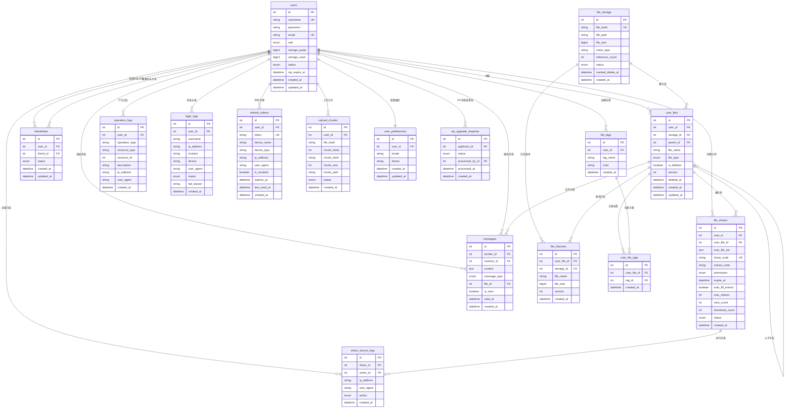

# 文件管理系统数据库设计文档

> **与代码对齐**：本文档以 `file_management_backend/prisma/schema.prisma` 及 Prisma 迁移生成的表结构为准。  
> **最后更新**：2026-04-18。

## 1. 数据库概述

本系统采用 MySQL 数据库，使用 Prisma ORM 进行数据访问。数据库设计遵循第三范式，支持多用户文件管理、文件去重、**链接分享**（含访问日志）、**VIP 升级申请与审核**、好友系统、消息系统、标签与版本历史等功能。另有 `_prisma_migrations` 表由 Prisma 维护，不在下文字段级展开。

## 2. 核心设计原则

1. **文件去重设计**：物理文件（file_storage）与用户文件引用（user_files）分离
2. **软删除机制**：用户文件支持逻辑删除，物理文件延迟删除
3. **引用计数**：通过引用计数管理物理文件的生命周期
4. **分片上传**：支持大文件分片上传和断点续传
5. **权限控制**：基于用户角色的权限管理

## 3. 数据表设计

### 3.1 用户表 (users)

存储用户基本信息和账户状态。

| 字段名 | 类型 | 约束 | 说明 |
|--------|------|------|------|
| id | INT | PRIMARY KEY, AUTO_INCREMENT | 用户ID |
| username | VARCHAR(50) | UNIQUE, NOT NULL | 用户名 |
| password | VARCHAR(64) | NOT NULL | 密码（SHA256加密） |
| email | VARCHAR(100) | UNIQUE | 邮箱 |
| role | ENUM('user', 'vip', 'admin') | NOT NULL, DEFAULT 'user' | 用户角色 |
| storage_quota | BIGINT | NOT NULL | 存储配额（字节） |
| storage_used | BIGINT | NOT NULL, DEFAULT 0 | 已使用存储（字节） |
| status | ENUM('active', 'disabled') | NOT NULL, DEFAULT 'active' | 账户状态 |
| vip_expire_at | DATETIME | NULL | VIP过期时间 |
| created_at | DATETIME | NOT NULL, DEFAULT CURRENT_TIMESTAMP | 创建时间 |
| updated_at | DATETIME | NOT NULL, DEFAULT CURRENT_TIMESTAMP ON UPDATE | 更新时间 |

**索引：**
- PRIMARY KEY (id)
- UNIQUE INDEX (username)
- UNIQUE INDEX (email)

**说明：**
- 普通用户 storage_quota = 1GB (1073741824)
- VIP用户 storage_quota = 2GB (2147483648)
- 管理员 storage_quota = -1 (不限制)

---

### 3.2 物理文件存储表 (file_storage)

存储服务器上的物理文件信息，多个用户可以引用同一个物理文件。

| 字段名 | 类型 | 约束 | 说明 |
|--------|------|------|------|
| id | INT | PRIMARY KEY, AUTO_INCREMENT | 物理文件ID |
| file_hash | VARCHAR(64) | UNIQUE, NOT NULL | 文件指纹哈希（实现为 SHA256，字段名沿用 file_hash） |
| file_path | VARCHAR(500) | NOT NULL | 服务器存储路径 |
| file_size | BIGINT | NOT NULL | 文件大小（字节） |
| mime_type | VARCHAR(100) | NOT NULL | 文件MIME类型 |
| reference_count | INT | NOT NULL, DEFAULT 0 | 引用计数 |
| status | ENUM('active', 'pending_delete') | NOT NULL, DEFAULT 'active' | 文件状态 |
| marked_delete_at | DATETIME | NULL | 标记删除时间 |
| created_at | DATETIME | NOT NULL, DEFAULT CURRENT_TIMESTAMP | 创建时间 |

**索引：**
- PRIMARY KEY (id)
- UNIQUE INDEX (file_hash)
- INDEX (status, marked_delete_at)

**说明：**
- file_hash 用于文件去重和秒传（与上传流程中的指纹算法一致）
- reference_count 为 0 时标记为 pending_delete
- marked_delete_at 后 24 小时物理删除

---

### 3.3 用户文件表 (user_files)

存储用户的文件引用信息，包括文件夹结构。

| 字段名 | 类型 | 约束 | 说明 |
|--------|------|------|------|
| id | INT | PRIMARY KEY, AUTO_INCREMENT | 用户文件ID |
| user_id | INT | NOT NULL | 用户ID |
| storage_id | INT | NULL | 物理文件ID（文件夹为NULL） |
| parent_id | INT | NULL | 父文件夹ID（根目录为NULL） |
| file_name | VARCHAR(255) | NOT NULL | 文件/文件夹名称 |
| file_type | ENUM('file', 'folder') | NOT NULL | 类型 |
| is_deleted | BOOLEAN | NOT NULL, DEFAULT FALSE | 是否删除（软删除） |
| deleted_at | DATETIME | NULL | 删除时间 |
| version | INT | NOT NULL, DEFAULT 1 | 当前版本号 |
| created_at | DATETIME | NOT NULL, DEFAULT CURRENT_TIMESTAMP | 创建时间 |
| updated_at | DATETIME | NOT NULL, DEFAULT CURRENT_TIMESTAMP ON UPDATE | 更新时间 |

**索引：**
- PRIMARY KEY (id)
- INDEX (user_id, parent_id, is_deleted)
- INDEX (storage_id)
- FOREIGN KEY (user_id) REFERENCES users(id) ON DELETE CASCADE
- FOREIGN KEY (storage_id) REFERENCES file_storage(id) ON DELETE SET NULL
- FOREIGN KEY (parent_id) REFERENCES user_files(id) ON DELETE CASCADE

**说明：**
- 支持文件夹层级结构
- 软删除：is_deleted = TRUE 表示在回收站
- 文件夹的 storage_id 为 NULL

---

### 3.4 文件分片上传记录表 (upload_chunks)

记录分片上传的进度，支持断点续传。

| 字段名 | 类型 | 约束 | 说明 |
|--------|------|------|------|
| id | INT | PRIMARY KEY, AUTO_INCREMENT | 记录ID |
| user_id | INT | NOT NULL | 用户ID |
| file_hash | VARCHAR(64) | NOT NULL | 文件哈希 |
| chunk_index | INT | NOT NULL | 分片索引 |
| chunk_hash | VARCHAR(64) | NOT NULL | 分片哈希 |
| chunk_size | INT | NOT NULL | 分片大小 |
| chunk_path | VARCHAR(500) | NOT NULL | 分片存储路径 |
| status | ENUM('uploading', 'completed', 'failed') | NOT NULL, DEFAULT 'uploading' | 状态 |
| created_at | DATETIME | NOT NULL, DEFAULT CURRENT_TIMESTAMP | 创建时间 |

**索引：**
- PRIMARY KEY (id)
- UNIQUE INDEX (file_hash, chunk_index)
- INDEX (user_id, file_hash)
- FOREIGN KEY (user_id) REFERENCES users(id) ON DELETE CASCADE

---

### 3.5 文件分享表 (file_shares)

存储**链接分享**信息（支持单选或多选文件/文件夹，`user_file_id` 与批量列表首项一致，便于外键与查询）。

| 字段名 | 类型 | 约束 | 说明 |
|--------|------|------|------|
| id | INT | PRIMARY KEY, AUTO_INCREMENT | 分享ID |
| user_id | INT | NOT NULL | 分享者ID |
| user_file_id | INT | NOT NULL | 主关联的 user_files.id（多选时通常为首项） |
| user_file_ids | JSON | NULL | 批量分享时全部 `user_files.id` 的 JSON 数组；与 `user_file_id` 同时写入 |
| share_code | VARCHAR(32) | UNIQUE, NOT NULL | 分享码（URL 路径段，唯一） |
| extract_code | VARCHAR(6) | NULL | 提取码；库列为 6 字符以内，**业务规则为固定 4 位**字母数字；无提取码表示公开访问 |
| permission | ENUM('view', 'download', 'edit') | NOT NULL, DEFAULT 'download' | 分享权限（当前实现创建时多为 download，可扩展） |
| expire_at | DATETIME | NULL | 过期时间（NULL 表示永久） |
| auto_fill_extract | TINYINT(1) / BOOLEAN | NOT NULL, DEFAULT FALSE | 是否在分享链接查询参数中带提取码（`?e=`） |
| max_visitors | INT | NULL | 访问人数上限；NULL 不限制（访客侧校验以实现为准） |
| view_count | INT | NOT NULL, DEFAULT 0 | 访问次数（展示/统计） |
| download_count | INT | NOT NULL, DEFAULT 0 | 下载次数（展示/统计） |
| status | ENUM('active', 'expired', 'cancelled') | NOT NULL, DEFAULT 'active' | 状态；过期可在访问时更新，也可由定时任务清理记录 |
| created_at | DATETIME | NOT NULL, DEFAULT CURRENT_TIMESTAMP | 创建时间 |

**索引：**
- PRIMARY KEY (id)
- UNIQUE INDEX (share_code)
- INDEX (user_id)
- INDEX (status, expire_at)
- FOREIGN KEY (user_id) REFERENCES users(id) ON DELETE CASCADE
- FOREIGN KEY (user_file_id) REFERENCES user_files(id) ON DELETE CASCADE

**说明：**
- 定时任务可删除 `expire_at` 早于当前时间的分享行，`share_access_logs` 随外键级联删除。

---

### 3.6 分享访问记录表 (share_access_logs)

记录分享链接的访问日志。

| 字段名 | 类型 | 约束 | 说明 |
|--------|------|------|------|
| id | INT | PRIMARY KEY, AUTO_INCREMENT | 日志ID |
| share_id | INT | NOT NULL | 分享ID |
| visitor_id | INT | NULL | 访问者ID（未登录为NULL） |
| ip_address | VARCHAR(45) | NOT NULL | IP地址 |
| user_agent | VARCHAR(500) | NULL | 浏览器信息 |
| action | ENUM('view', 'download') | NOT NULL | 操作类型 |
| created_at | DATETIME | NOT NULL, DEFAULT CURRENT_TIMESTAMP | 访问时间 |

**索引：**
- PRIMARY KEY (id)
- INDEX (share_id, created_at)
- FOREIGN KEY (share_id) REFERENCES file_shares(id) ON DELETE CASCADE
- FOREIGN KEY (visitor_id) REFERENCES users(id) ON DELETE SET NULL

---

### 3.7 好友关系表 (friendships)

存储用户之间的好友关系。

| 字段名 | 类型 | 约束 | 说明 |
|--------|------|------|------|
| id | INT | PRIMARY KEY, AUTO_INCREMENT | 关系ID |
| user_id | INT | NOT NULL | 用户ID |
| friend_id | INT | NOT NULL | 好友ID |
| status | ENUM('pending', 'accepted', 'rejected', 'blocked') | NOT NULL, DEFAULT 'pending' | 状态 |
| created_at | DATETIME | NOT NULL, DEFAULT CURRENT_TIMESTAMP | 创建时间 |
| updated_at | DATETIME | NOT NULL, DEFAULT CURRENT_TIMESTAMP ON UPDATE | 更新时间 |

**索引：**
- PRIMARY KEY (id)
- UNIQUE INDEX (user_id, friend_id)
- INDEX (friend_id, status)
- FOREIGN KEY (user_id) REFERENCES users(id) ON DELETE CASCADE
- FOREIGN KEY (friend_id) REFERENCES users(id) ON DELETE CASCADE

**说明：**
- pending: 待审核
- accepted: 已接受
- rejected: 已拒绝
- blocked: 已拉黑

---

### 3.8 消息表 (messages)

存储用户之间的消息。

| 字段名 | 类型 | 约束 | 说明 |
|--------|------|------|------|
| id | INT | PRIMARY KEY, AUTO_INCREMENT | 消息ID |
| sender_id | INT | NOT NULL | 发送者ID |
| receiver_id | INT | NOT NULL | 接收者ID |
| content | TEXT | NOT NULL | 消息内容 |
| message_type | ENUM('text', 'file') | NOT NULL, DEFAULT 'text' | 消息类型 |
| file_id | INT | NULL | 文件ID（文件消息） |
| is_read | BOOLEAN | NOT NULL, DEFAULT FALSE | 是否已读 |
| read_at | DATETIME | NULL | 阅读时间 |
| created_at | DATETIME | NOT NULL, DEFAULT CURRENT_TIMESTAMP | 发送时间 |

**索引：**
- PRIMARY KEY (id)
- INDEX (receiver_id, is_read, created_at)
- INDEX (sender_id, created_at)
- FOREIGN KEY (sender_id) REFERENCES users(id) ON DELETE CASCADE
- FOREIGN KEY (receiver_id) REFERENCES users(id) ON DELETE CASCADE
- FOREIGN KEY (file_id) REFERENCES user_files(id) ON DELETE SET NULL

---

### 3.9 文件标签表 (file_tags)

存储文件标签信息。

| 字段名 | 类型 | 约束 | 说明 |
|--------|------|------|------|
| id | INT | PRIMARY KEY, AUTO_INCREMENT | 标签ID |
| user_id | INT | NOT NULL | 用户ID |
| tag_name | VARCHAR(50) | NOT NULL | 标签名称 |
| color | VARCHAR(7) | NULL | 标签颜色（HEX） |
| created_at | DATETIME | NOT NULL, DEFAULT CURRENT_TIMESTAMP | 创建时间 |

**索引：**
- PRIMARY KEY (id)
- UNIQUE INDEX (user_id, tag_name)
- FOREIGN KEY (user_id) REFERENCES users(id) ON DELETE CASCADE

---

### 3.10 文件标签关联表 (user_file_tags)

关联用户文件和标签的多对多关系。

| 字段名 | 类型 | 约束 | 说明 |
|--------|------|------|------|
| id | INT | PRIMARY KEY, AUTO_INCREMENT | 关联ID |
| user_file_id | INT | NOT NULL | 用户文件ID |
| tag_id | INT | NOT NULL | 标签ID |
| created_at | DATETIME | NOT NULL, DEFAULT CURRENT_TIMESTAMP | 创建时间 |

**索引：**
- PRIMARY KEY (id)
- UNIQUE INDEX (user_file_id, tag_id)
- INDEX (tag_id)
- FOREIGN KEY (user_file_id) REFERENCES user_files(id) ON DELETE CASCADE
- FOREIGN KEY (tag_id) REFERENCES file_tags(id) ON DELETE CASCADE

---

### 3.11 操作日志表 (operation_logs)

记录用户的重要操作。

| 字段名 | 类型 | 约束 | 说明 |
|--------|------|------|------|
| id | INT | PRIMARY KEY, AUTO_INCREMENT | 日志ID |
| user_id | INT | NOT NULL | 用户ID |
| operation_type | VARCHAR(50) | NOT NULL | 操作类型 |
| resource_type | VARCHAR(50) | NOT NULL | 资源类型 |
| resource_id | INT | NULL | 资源ID |
| description | VARCHAR(500) | NULL | 操作描述 |
| ip_address | VARCHAR(45) | NOT NULL | IP地址 |
| user_agent | VARCHAR(500) | NULL | 浏览器信息 |
| created_at | DATETIME | NOT NULL, DEFAULT CURRENT_TIMESTAMP | 操作时间 |

**索引：**
- PRIMARY KEY (id)
- INDEX (user_id, created_at)
- INDEX (operation_type, created_at)
- FOREIGN KEY (user_id) REFERENCES users(id) ON DELETE CASCADE

**操作类型示例：**
- upload, download, delete, share, rename, move, etc.

---

### 3.12 登录日志表 (login_logs)

记录用户登录信息，包括成功和失败的登录尝试。

| 字段名 | 类型 | 约束 | 说明 |
|--------|------|------|------|
| id | INT | PRIMARY KEY, AUTO_INCREMENT | 日志ID |
| user_id | INT | NULL | 用户ID（登录失败时可能为NULL） |
| username | VARCHAR(50) | NULL | 尝试登录的用户名 |
| ip_address | VARCHAR(45) | NOT NULL | IP地址 |
| location | VARCHAR(100) | NULL | 登录地点 |
| device | VARCHAR(100) | NULL | 设备信息 |
| user_agent | VARCHAR(500) | NULL | 浏览器信息 |
| status | ENUM('success', 'failed') | NOT NULL | 登录状态 |
| fail_reason | VARCHAR(200) | NULL | 失败原因 |
| created_at | DATETIME | NOT NULL, DEFAULT CURRENT_TIMESTAMP | 登录时间 |

**索引：**
- PRIMARY KEY (id)
- INDEX (user_id, created_at)
- INDEX (ip_address, created_at)
- INDEX (username)
- FOREIGN KEY (user_id) REFERENCES users(id) ON DELETE SET NULL

**说明：**
- user_id 允许为 NULL，以便记录登录失败的尝试（用户不存在的情况）
- username 字段记录尝试登录的用户名，用于安全审计
- 外键使用 ON DELETE SET NULL，删除用户时保留登录日志

---

### 3.13 文件历史版本表 (file_histories)

存储文件的历史版本记录（主从表模式，存旧版本）。

| 字段名 | 类型 | 约束 | 说明 |
|--------|------|------|------|
| id | INT | PRIMARY KEY, AUTO_INCREMENT | 历史ID |
| user_file_id | INT | NOT NULL | 用户文件ID |
| storage_id | INT | NOT NULL | 物理文件ID |
| file_name | VARCHAR(255) | NOT NULL | 当时文件名 |
| version | INT | NOT NULL | 版本号 |
| file_size | BIGINT | NOT NULL | 文件大小 |
| created_at | DATETIME | NOT NULL, DEFAULT CURRENT_TIMESTAMP | 归档时间 |

**索引：**
- PRIMARY KEY (id)
- INDEX (user_file_id, version)
- FOREIGN KEY (user_file_id) REFERENCES user_files(id) ON DELETE CASCADE
- FOREIGN KEY (storage_id) REFERENCES file_storage(id) ON DELETE CASCADE

---

### 3.14 刷新令牌表 (refresh_tokens)

存储用户的Refresh Token信息，支持多设备登录管理。

| 字段名 | 类型 | 约束 | 说明 |
|--------|------|------|------|
| id | INT | PRIMARY KEY, AUTO_INCREMENT | 令牌ID |
| user_id | INT | NOT NULL | 用户ID |
| token | VARCHAR(500) | UNIQUE, NOT NULL | Refresh Token |
| device_name | VARCHAR(100) | NULL | 设备名称 |
| device_type | VARCHAR(50) | NULL | 设备类型（web/mobile/desktop） |
| ip_address | VARCHAR(45) | NOT NULL | IP地址 |
| user_agent | VARCHAR(500) | NULL | 浏览器信息 |
| is_revoked | BOOLEAN | NOT NULL, DEFAULT FALSE | 是否已撤销 |
| expires_at | DATETIME | NOT NULL | 过期时间 |
| last_used_at | DATETIME | NULL | 最后使用时间 |
| created_at | DATETIME | NOT NULL, DEFAULT CURRENT_TIMESTAMP | 创建时间 |

**索引：**
- PRIMARY KEY (id)
- UNIQUE INDEX (token)
- INDEX (user_id, is_revoked, expires_at)
- INDEX (expires_at)
- FOREIGN KEY (user_id) REFERENCES users(id) ON DELETE CASCADE

**说明：**
- token 存储加密后的 Refresh Token
- is_revoked = TRUE 表示token已被撤销（登出、修改密码等）
- expires_at 默认为创建时间 + 7天
- last_used_at 记录最后一次使用该token刷新Access Token的时间

---

### 3.15 用户配置表 (user_preferences)

存储用户的界面偏好设置，如语言和主题。

| 字段名 | 类型 | 约束 | 说明 |
|--------|------|------|------|
| id | INT | PRIMARY KEY, AUTO_INCREMENT | 配置ID |
| user_id | INT | UNIQUE, NOT NULL | 用户ID |
| locale | VARCHAR(10) | NOT NULL, DEFAULT 'auto' | 语言设置 ('zh-CN', 'zh-TW', 'en-US', 'auto') |
| theme | VARCHAR(10) | NOT NULL, DEFAULT 'auto' | 主题设置 ('light', 'dark', 'auto') |
| created_at | DATETIME | NOT NULL, DEFAULT CURRENT_TIMESTAMP | 创建时间 |
| updated_at | DATETIME | NOT NULL, DEFAULT CURRENT_TIMESTAMP ON UPDATE | 更新时间 |

**索引：**
- PRIMARY KEY (id)
- UNIQUE INDEX (user_id)
- FOREIGN KEY (user_id) REFERENCES users(id) ON DELETE CASCADE

**说明：**
- 每个用户只有一条配置记录
- 默认为 'auto'，表示跟随浏览器或系统设置

---

### 3.16 VIP 升级申请表 (vip_upgrade_requests)

普通用户提交 **VIP 升级申请**，管理员审核（通讯录「VIP 申请」或会话内操作）。与 `users` 存在申请人、处理人两条可选外键。

| 字段名 | 类型 | 约束 | 说明 |
|--------|------|------|------|
| id | INT | PRIMARY KEY, AUTO_INCREMENT | 申请记录ID |
| applicant_id | INT | NOT NULL | 申请人 user id |
| status | ENUM('pending', 'approved', 'rejected') | NOT NULL, DEFAULT 'pending' | 审核状态 |
| processed_by_id | INT | NULL | 处理人（管理员）user id |
| processed_at | DATETIME | NULL | 处理时间 |
| created_at | DATETIME | NOT NULL, DEFAULT CURRENT_TIMESTAMP | 申请时间 |

**索引：**
- PRIMARY KEY (id)
- INDEX (status)
- INDEX (applicant_id, status)
- FOREIGN KEY (applicant_id) REFERENCES users(id) ON DELETE CASCADE
- FOREIGN KEY (processed_by_id) REFERENCES users(id) ON DELETE SET NULL

---

## 4. ER 关系图

### 4.1 完整 ER 图（Mermaid）



### 4.2 核心关系说明

**用户中心关系：**
- 一个用户可以拥有多个文件（user_files）
- 一个用户可以创建多个分享链接（file_shares）
- 用户可作为申请人或审批人关联多条 VIP 升级记录（vip_upgrade_requests：`applicant_id` / `processed_by_id`）
- 已登录访客访问分享时，`share_access_logs.visitor_id` 可指向用户（未登录为 NULL）
- 用户之间可以建立好友关系（friendships）
- 用户之间可以发送消息（messages）
- 一个用户可以有多个登录会话（refresh_tokens）
- 一个用户对应一条界面偏好设置（user_preferences）

**文件去重机制：**
- 多个用户文件（user_files）可以引用同一个物理文件（file_storage）
- 通过 reference_count 管理物理文件的生命周期

**文件夹层级：**
- user_files 表通过 parent_id 自关联实现文件夹层级结构

**分片上传：**
- `upload_chunks` 仅与 `users` 外键关联；通过 `file_hash` + `chunk_index` 与合并后的 `file_storage` **逻辑对应**，Prisma 中未建立 `upload_chunks → file_storage` 外键

**文件标签：**
- file_tags 和 user_files 通过 user_file_tags 实现多对多关系

### 4.3 简化关系树

```
users (用户)
  ├─→ user_files (用户文件)
  │     ├─→ file_storage (物理文件)
  │     ├─→ user_file_tags (文件标签关联)
  │     └─→ file_histories (文件历史)
  ├─→ file_shares (文件分享)
  ├─→ friendships (好友关系)
  ├─→ messages (消息)
  ├─→ file_tags (标签)
  ├─→ operation_logs (操作日志)
  ├─→ login_logs (登录日志)
  ├─→ refresh_tokens (刷新令牌)
  ├─→ upload_chunks (分片上传记录，仅 user_id 外键)
  ├─→ vip_upgrade_requests (VIP 申请，申请人/处理人)
  ├─→ share_access_logs (作为访客 visitor_id，可选)
  └─→ user_preferences (用户偏好)

file_storage (物理文件)
  （合并完成后由业务写入；与 upload_chunks 无数据库外键）

file_shares (文件分享)
  └─→ share_access_logs (访问日志)
```

## 5. 核心业务逻辑

### 5.1 双Token认证流程

**登录流程：**
1. 用户提交用户名和密码
2. 验证成功后，生成 Access Token（15分钟有效）和 Refresh Token（7天有效）
3. 将 Refresh Token 存入 `refresh_tokens` 表
4. 记录登录日志到 `login_logs` 表
5. 返回两个token给前端
6. 前端将 Access Token 存储在内存，Refresh Token 存储在 HttpOnly Cookie 或 LocalStorage

**API请求流程：**
1. 前端在请求头中携带 Access Token
2. 后端验证 Access Token 是否有效
3. 如果有效，处理请求
4. 如果过期，返回 401 状态码

**Token刷新流程：**
1. 前端收到 401 状态码，自动调用刷新接口
2. 携带 Refresh Token 请求新的 Access Token
3. 后端验证 Refresh Token：
   - 检查是否存在于 `refresh_tokens` 表
   - 检查是否已撤销（is_revoked）
   - 检查是否过期（expires_at）
4. 验证通过，生成新的 Access Token
5. 更新 `refresh_tokens.last_used_at`
6. 返回新的 Access Token
7. 前端使用新token重试原请求

**登出流程：**
1. 用户主动登出
2. 将对应的 Refresh Token 标记为已撤销（is_revoked = TRUE）
3. 前端清除所有token

**修改密码/安全操作：**
1. 执行安全操作后，撤销该用户所有 Refresh Token
2. 强制所有设备重新登录

**多设备管理：**
1. 查询用户的所有未撤销的 Refresh Token
2. 显示设备列表（设备名称、登录时间、最后使用时间、IP）
3. 用户可以选择撤销指定设备的token

### 5.2 文件上传流程

1. 前端计算文件 MD5 (file_hash)
2. 检查 `file_storage` 表是否存在该 file_hash
3. **秒传**：如果存在，直接在 `user_files` 创建引用，`reference_count++`
4. **分片上传**：如果不存在，创建 `upload_chunks` 记录
5. 所有分片上传完成后，合并文件
6. 创建 `file_storage` 记录，`reference_count = 1`
7. 创建 `user_files` 记录
8. 更新用户 `storage_used`

### 5.3 文件删除流程

1. 用户删除文件：设置 `user_files.is_deleted = TRUE`
2. 回收站恢复：设置 `user_files.is_deleted = FALSE`
3. 彻底删除：
   - 删除 `user_files` 记录
   - `file_storage.reference_count--`
   - 如果 `reference_count = 0`，设置 `status = 'pending_delete'`，记录 `marked_delete_at`
   - 定时任务检查 `marked_delete_at + 24小时`，物理删除文件
4. 更新用户 `storage_used`

### 5.4 存储配额计算

```sql
-- 计算用户已使用存储
SELECT SUM(fs.file_size) 
FROM user_files uf
JOIN file_storage fs ON uf.storage_id = fs.id
WHERE uf.user_id = ? AND uf.is_deleted = FALSE AND uf.file_type = 'file'
```

### 5.5 链接分享与过期清理

1. 分享创建后写入 `file_shares`；访客校验提取码（若有）并访问时写入 `share_access_logs`（`action` 为 view / download）。
2. `expire_at` 早于当前时间的分享在访问逻辑中可标记为 `expired`；定时任务可删除 `expire_at` 已过的行以回收数据，并级联删除其访问日志。

### 5.6 好友关系管理

1. 用户A发送好友请求：创建 `friendships` 记录，`status = 'pending'`
2. 用户B接受：更新 `status = 'accepted'`，同时创建反向关系记录
3. 用户B拒绝：更新 `status = 'rejected'`

### 5.7 文件版本管理

1. **版本更新**：
    - 用户上传同名文件（且选择“覆盖”或“保存新版本”）。
    - 将当前的 `user_files` 记录（包含 `storage_id`, `file_name`, `file_size`, `version` 等）归档到 `file_histories` 表。
    - 更新 `user_files` 表为新上传的文件信息（新的 `storage_id`），同时 `version` + 1。
2. **版本回滚**：
    - 用户选择某个历史版本进行回滚。
    - 将当前的 `user_files` 记录再次归档到 `file_histories`。
    - 将选中的历史版本信息（`storage_id`, `file_size` 等）覆盖回 `user_files` 表。
    - `version` 继续 +1，以保持线性历史。
3. **版本删除**：
    - 删除主文件 (`user_files`) 时，级联删除所有的 `file_histories`。
    - 也可以单独删除某个历史版本记录。
4. **版本预览/下载**：
    - 支持直接通过 `file_histories.id` 获取物理文件（`storage_id`）进行预览或下载，无需回滚。

## 6. 性能优化建议

1. **索引优化**：为常用查询字段添加索引
2. **分区表**：日志表按时间分区
3. **缓存策略**：
   - 用户信息缓存（Redis）
   - 文件哈希缓存（秒传检测）
   - 分享链接缓存
4. **定时任务**：
   - 清理过期分片（24小时，以实现为准）
   - 清理待删除物理文件（`pending_delete` 且超过保留期）
   - 清理已过期的分享记录（`file_shares.expire_at`）
   - 清理过期的 Refresh Token
5. **读写分离**：日志表使用从库查询

## 7. 安全性考虑

1. **密码加密**：SHA256 + 盐值
2. **SQL注入防护**：使用 Prisma ORM 参数化查询
3. **文件访问控制**：验证用户权限
4. **分享链接**：使用随机生成的 share_code
5. **敏感信息**：不在日志中记录密码等敏感信息
6. **Token安全**：
   - Access Token 短期有效（15分钟）
   - Refresh Token 长期有效（7天）
   - Refresh Token 存储加密
   - 支持token撤销和黑名单机制
   - HttpOnly Cookie 防止XSS攻击
7. **CSRF防护**：使用CSRF Token或SameSite Cookie
8. **异常检测**：监控异地登录、频繁刷新token等异常行为

## 8. 扩展性设计

1. **文件存储**：支持扩展到对象存储（OSS）
2. **分布式**：file_hash 可用于分布式文件存储
3. **消息系统**：可扩展为实时消息（WebSocket）
4. **文件预览**：可添加缩略图表
5. **搜索优化**：可集成 Elasticsearch

---

**文档版本**：v1.1  
**最后更新**：2026-04-18（与 `prisma/schema.prisma` 对齐）
