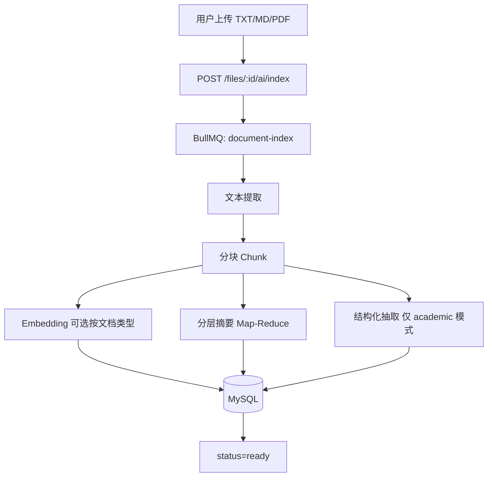

# AI 能力补强计划书 — Document Intelligence 路线图

> 日期：2026-07-08  
> 状态：待执行（明天 2026-07-09 启动）  
> 关联项目：`file_management_backend_nest` + `file_management_frontend`  
> 前置能力：S3 划词流式问答（✅ 已完成）

---

## 1. 背景与目标

### 1.1 为什么要补

- 招聘 JD 中「AI / 大模型 / RAG / 智能文档」要求增多。
- 你 **已有** LLM 接入经验（Vercel AI SDK + DeepSeek + 流式 + Abort），但简历上容易被归类为「调过 API」，缺 **RAG、长文档、结构化抽取** 等可讲故事的能力。
- 目标不是转算法，而是在 **现有网盘项目** 上扩展 **Document Intelligence（文档智能）**，形成可演示、可写进简历、可面试展开的三条线。

### 1.2 总目标（4～6 周）

| 目标 | 验收标准 |
|------|----------|
| **产品线清晰** | 划词 / 长文档 RAG+摘要 / 学术结构化抽取，三条线 API 分明 |
| **工程可演示** | 上传文档 → 异步索引 → 前端可问、可总结、可看知识点卡片 |
| **简历可写** | 至少 1 篇技术文章 + README 架构图 + 3 条量化 bullets |
| **测试可回归** | 每阶段 e2e 全绿，`jest.mock('ai')` 不依赖真实 API Key |

### 1.3 非目标（本阶段不做）

- 自训模型 / Fine-tuning
- 多模态识图（PDF 内图片 OCR，留后续）
- 独立向量数据库集群（先用 MySQL JSON + 应用层相似度，规模大了再迁）
- LangChain 全栈引入（保持 `ai` SDK + 自研流水线，便于面试讲清楚）

---

## 2. 现状基线（S3 已有）

### 2.1 后端

| 路径 | 能力 |
|------|------|
| `src/files/ai/files-ai.service.ts` | `streamText`、System Prompt、多轮历史、长度限制 |
| `src/files/ai/files-ai.controller.ts` | `POST /api/files/:id/ai/ask`，text/plain 流式 |
| 环境变量 | `AI_API_KEY`、`AI_BASE_URL`、`AI_MODEL` |

### 2.2 前端

| 路径 | 能力 |
|------|------|
| `src/api/ai.ts` | fetch + ReadableStream + AbortController |

### 2.3 可复用基础设施

- **BullMQ + Worker**（预览 Worker 模式 → 文档索引 Worker）
- **Prisma + MySQL**
- **Redis**（任务状态、可选缓存摘要）
- **Pino 日志**
- **e2e 测试体系**（21 个 spec，可追加 `files-ai-*`）

---

## 3. 三条能力线（产品矩阵）

```
                    ┌─────────────────────────────────────────┐
                    │         Document Intelligence           │
                    └─────────────────────────────────────────┘
         线 A                    线 B                      线 C
    划词上下文问答           长文档智能                    学术文献
    （S3 ✅）              RAG + 分层摘要              结构化知识点
         │                    │                          │
   用户手动选中            自动检索 Top-K              Section 解析
   selectedText           + 全书/章节总结              + JSON Schema 抽取
         │                    │                          │
   POST .../ai/ask      POST .../ai/rag-ask         POST .../ai/knowledge
                        GET  .../ai/summary          GET  .../ai/knowledge
                        POST .../ai/analyze          POST .../ai/compare（进阶）
```

| 线 | 典型场景 | 核心技术 | 阶段 |
|----|----------|----------|------|
| **A** | 「这段什么意思？」 | Context Injection + 流式 | S3 ✅ |
| **B** | 《哈利波特》全书总结、某章情节、主题 | Map-Reduce 摘要 + Embedding RAG | S12～S13 |
| **C** | PDF 论文：贡献/方法/结论卡片 | Section-aware 分块 + `generateObject` | S14～S15 |

**线 B 与线 C 共用底层**：文本提取 → 分块 →（可选）embedding → 入库；差异在 **下游任务**（摘要树 vs 结构化 schema）。

---

## 4. 统一架构

### 4.1 目录规划（Nest）

```
src/files/ai/
  files-ai.controller.ts          # 现有 + 新端点
  files-ai.service.ts             # 线 A
  files-ai-rag.service.ts         # 线 B：检索 + 问答
  files-ai-summary.service.ts     # 线 B：摘要读写
  files-ai-knowledge.service.ts   # 线 C：结构化抽取
  files-ai-index.service.ts       # 索引编排（入队、状态）
  files-ai.types.ts
  files-ai.schemas.ts             # Zod：KnowledgeCard、Summary 等
  chunk/
    text-chunker.ts               # 固定长度 / 章节感知
    text-extractor.ts            # TXT/MD 优先；PDF 二期
  embedding/
    embedding.provider.ts          # DeepSeek/OpenAI compatible embeddings API
    similarity.util.ts             # cosine，MySQL JSON 向量
  prompt/
    rag.prompt.ts
    summary.prompt.ts
    knowledge.prompt.ts

src/files/ai-worker/              # 或复用 jobs/ + preview-worker 模式
  document-index.processor.ts     # BullMQ：extract → chunk → embed → summarize
  document-index.module.ts

src/worker.main.ts                # 注册 document-index processor（与 preview 并列或合并）
```

### 4.2 异步流水线（所有新能力共用）



### 4.3 文档类型（`indexMode`）

| mode | 说明 | 下游 |
|------|------|------|
| `selection` | 不索引，仅线 A | — |
| `general` | 长文 / 小说 | chunk + embed + 分层摘要 + theme |
| `academic` | 期刊 / 论文 | section 分块 + embed + structured knowledge + section 摘要 |

---

## 5. 数据模型（Prisma 新增）

```prisma
enum DocumentIndexStatus {
  pending
  extracting
  chunking
  embedding
  summarizing
  extracting_knowledge
  ready
  failed
}

enum DocumentIndexMode {
  general
  academic
}

enum DocumentChunkSection {
  unknown
  abstract
  introduction
  method
  results
  discussion
  references
  body
  chapter
}

model DocumentIndexJob {
  id           Int                  @id @default(autoincrement())
  userFileId   Int                  @unique @map("user_file_id")
  mode         DocumentIndexMode
  status       DocumentIndexStatus  @default(pending)
  progress     Int                  @default(0)        // 0-100
  progressMsg  String?              @map("progress_msg") @db.VarChar(255)
  errorMessage String?              @map("error_message") @db.Text
  chunkCount   Int                  @default(0) @map("chunk_count")
  createdAt    DateTime             @default(now()) @map("created_at")
  updatedAt    DateTime             @updatedAt @map("updated_at")

  userFile UserFile @relation(fields: [userFileId], references: [id], onDelete: Cascade)

  @@map("document_index_jobs")
}

model DocumentChunk {
  id          Int                   @id @default(autoincrement())
  userFileId  Int                   @map("user_file_id")
  chunkIndex  Int                   @map("chunk_index")
  section     DocumentChunkSection  @default(body)
  sectionTitle String?              @map("section_title") @db.VarChar(255)
  chapterNo   Int?                  @map("chapter_no")
  content     String                @db.Text
  tokenEstimate Int?                @map("token_estimate")
  embedding   Json?                 // number[]，MVP 存 MySQL；量大迁向量库
  createdAt   DateTime              @default(now()) @map("created_at")

  userFile UserFile @relation(fields: [userFileId], references: [id], onDelete: Cascade)

  @@unique([userFileId, chunkIndex])
  @@index([userFileId, section])
  @@map("document_chunks")
}

enum DocumentSummaryType {
  chunk
  chapter
  book
  theme
  section   // academic：method/results 等节摘要
}

model DocumentSummary {
  id         Int                  @id @default(autoincrement())
  userFileId Int                  @map("user_file_id")
  type       DocumentSummaryType
  refKey     String               @map("ref_key") @db.VarChar(64)  // 如 "chapter:3" / "book" / "theme"
  content    String               @db.Text
  createdAt  DateTime             @default(now()) @map("created_at")
  updatedAt  DateTime             @updatedAt @map("updated_at")

  userFile UserFile @relation(fields: [userFileId], references: [id], onDelete: Cascade)

  @@unique([userFileId, type, refKey])
  @@map("document_summaries")
}

model DocumentKnowledge {
  id         Int      @id @default(autoincrement())
  userFileId Int      @unique @map("user_file_id")
  payload    Json     // 结构化知识卡片，见 §5.1
  createdAt  DateTime @default(now()) @map("created_at")
  updatedAt  DateTime @updatedAt @map("updated_at")

  userFile UserFile @relation(fields: [userFileId], references: [id], onDelete: Cascade)

  @@map("document_knowledge")
}
```

需在 `UserFile` 上增加 relations：`documentIndexJob`、`documentChunks`、`documentSummaries`、`documentKnowledge`。

### 5.1 学术知识卡片 Schema（Zod / JSON）

```typescript
// files-ai.schemas.ts — 面试 & 前端 TypeScript 共用
{
  title: string;
  researchQuestion: string | null;
  contributions: string[];
  methodology: {
    approach: string | null;
    dataset: string | null;
    metrics: string[];
  };
  keyFindings: Array<{
    claim: string;
    evidence: string | null;  // Table 2 / Fig.1
    section: string;
  }>;
  definitions: Array<{ term: string; definition: string; section: string }>;
  limitations: string[];
  futureWork: string[];
  keywords: string[];
}
```

---

## 6. API 设计

### 6.1 索引与状态

| 端点 | 方法 | 说明 |
|------|------|------|
| `/api/files/:id/ai/index` | POST | Body: `{ mode: 'general' \| 'academic' }`，触发异步索引 |
| `/api/files/:id/ai/index/status` | GET | 返回 status、progress、progressMsg、chunkCount |
| `/api/files/:id/ai/index` | DELETE | 清除索引数据（可选，S13） |

**约束：**

- 仅文本类文件（`.txt`、`.md`）在 S12 支持；PDF 在 S13 接入现有预览提取链路。
- 单用户并发索引 job 限 1（Redis 或 DB 锁）。
- 重复 `POST index`：若 `ready` 则 409 或强制 `reindex=true`。

### 6.2 线 B — 长文档

| 端点 | 方法 | 说明 |
|------|------|------|
| `/api/files/:id/ai/rag-ask` | POST | Body: `{ question, messages? }`，流式 text/plain，Top-K chunk 增强 |
| `/api/files/:id/ai/summary` | GET | Query: `type=book\|chapter\|theme`, `chapterNo?` |
| `/api/files/:id/ai/analyze` | POST | Body: `{ type: 'theme' \| 'characters' }`，基于摘要层生成（可流式） |

### 6.3 线 C — 学术

| 端点 | 方法 | 说明 |
|------|------|------|
| `/api/files/:id/ai/knowledge` | GET | 返回 `DocumentKnowledge.payload` JSON |
| `/api/files/:id/ai/knowledge/section` | GET | Query: `section=method`，返回该节摘要 + 要点 |

### 6.4 线 A — 保持不变

| 端点 | 方法 | 说明 |
|------|------|------|
| `/api/files/:id/ai/ask` | POST | 划词问答（已有） |

### 6.5 横切：AI 限流与配置

新增环境变量：

```env
AI_API_KEY=...
AI_BASE_URL=https://api.deepseek.com
AI_MODEL=deepseek-chat
AI_EMBEDDING_MODEL=text-embedding-3-small   # 或 DeepSeek 兼容 embedding 模型名
AI_MAX_INDEX_CHUNKS=500                     # 单文件 chunk 上限，防成本爆炸
AI_DAILY_ASK_LIMIT=100                      # 每用户每日 AI 请求上限（Redis）
```

---

## 7. 核心算法说明

### 7.1 线 B — 分层摘要（Map-Reduce）

适用于小说 / 长报告（`mode=general`）：

1. **Chunk 摘要（Map）**：每块 500～800 字 → LLM 3～5 句摘要。
2. **Chapter 摘要（Reduce）**：按 `chapterNo` 或固定 batch 合并 chunk 摘要。
3. **Book 摘要（Reduce）**：章摘要再合并；超长则 batch 递归。
4. **Theme 分析**：输入 book + chapter 摘要（非原文）→ 3～5 主题 + 依据。

**存储：** 写入 `DocumentSummary`，用户问「全书讲什么」**读库**，不实时跑全书。

### 7.2 线 B — RAG 问答

1. 问题 → embedding。
2. 在 `DocumentChunk` 上做 cosine Top-K（K=5～8）。
3. Hybrid（S13）：人名/术语 BM25 或 `LIKE` 辅助（MySQL FULLTEXT 可选）。
4. Prompt：`仅根据以下片段回答，片段不足则说明不知道` + chunks。
5. `streamText` 流式返回（与线 A 一致）。

### 7.3 线 C — 学术结构化抽取

1. **Section 识别（MVP）**：Markdown 标题 `#` / `##`；纯文本用正则匹配 `Abstract`、`Introduction`、`Method` 等。
2. **按 section 调用 `generateObject`**：Zod schema，每节独立抽，禁止跨节编造。
3. **合并** 为 `DocumentKnowledge.payload`。
4. **Section 摘要** 并行写入 `DocumentSummary`（type=section）。

### 7.4 RAG vs 摘要 — 决策表（面试用）

| 用户意图 | 走哪条线 |
|----------|----------|
| 定位某细节 / 引文 | RAG |
| 全书 / 章节总结 | 预生成 Summary |
| 主题 / 人物弧光 | Summary 层 + Analyze |
| 论文知识点卡片 | Knowledge JSON |
| 主题 + 原文例证 | Summary 定调 + RAG 找片段 |

---

## 8. 前端改造（Vue3）

### 8.1 文件详情页 — AI 面板 Tab

```
[ 划词问答 ]  [ 文档问答 RAG ]  [ 摘要 ]  [ 知识点 ]   ← 后三个按 index status 启用
```

| Tab | 行为 |
|-----|------|
| 划词问答 | 现有 UI |
| 文档问答 | 无选中文字；显示索引状态；ready 后可多轮流式 |
| 摘要 | 下拉：全书 / 第 N 章 / 主题分析 |
| 知识点 | 仅 academic；卡片 UI 渲染 JSON |

### 8.2 新增 API 模块

`src/api/ai.ts` 扩展：

- `triggerDocumentIndex(fileId, mode)`
- `getDocumentIndexStatus(fileId)`
- `streamRagAsk(...)` — 复用现有流式读取逻辑
- `getDocumentSummary(fileId, params)`
- `getDocumentKnowledge(fileId)`

### 8.3 索引进度 UX

- `processing` 时轮询 `index/status` 或 Socket 推送（可选，S13）。
- 显示：`正在摘要 12/36 章…`

---

## 9. 分阶段实施计划（明天起）

### 总览

| 阶段 | 代号 | 周期 | 交付 |
|------|------|------|------|
| 0 | 准备 | Day 1（07-09） | 环境、分支、Prisma 设计评审 |
| 1 | S12 | Day 2～7 | 索引流水线 MVP + RAG 问答（TXT/MD） |
| 2 | S13 | Day 8～14 | 分层摘要 + theme + 前端 Tab + PDF 文本 |
| 3 | S14 | Day 15～21 | 学术 structured knowledge |
| 4 | S15 | Day 22～28 | 限流、对比、文章、简历、CI |

---

### 阶段 0 — 准备（2026-07-09，第 1 天）

**Task 0.1** 创建分支 `feature/ai-document-intelligence`

**Task 0.2** 确认 embedding API 可用（DeepSeek 或 OpenAI compatible），写 `.env.example` 补充 AI 相关变量

**Task 0.3** 阅读本文档 + 画出个人笔记版数据流（30 分钟）

**Task 0.4** Prisma 迁移：`DocumentIndexJob`、`DocumentChunk`（先不加 Summary/Knowledge 表）

**验收：** `pnpm prisma:generate && pnpm build`

---

### 阶段 1 — S12：索引 + RAG MVP（Day 2～7）

#### 目标

上传 `.txt` / `.md` → 一键索引 → `rag-ask` 流式问答。

#### Task 1.1 文本提取与分块

- `text-extractor.ts`：读 storage 本地/MinIO 文件为 UTF-8 字符串
- `text-chunker.ts`：800 字/块，overlap 100，`AI_MAX_INDEX_CHUNKS` 截断

#### Task 1.2 Embedding

- `embedding.provider.ts`：`embedMany(texts[])` 批量调用
- `similarity.util.ts`：cosine，从 MySQL JSON 读向量

#### Task 1.3 BullMQ Processor

- Queue 名：`document-index`
- 步骤：extract → chunk 入库 → embed 写回 → status=ready
- 进度：更新 `progress` / `progressMsg`

#### Task 1.4 API

- `POST /ai/index`、`GET /ai/index/status`
- `POST /ai/rag-ask`（流式，mock 可测）

#### Task 1.5 E2E

- `test/e2e/files-ai-rag.e2e-spec.ts`
- mock embedding + streamText

#### Task 1.6 前端最小 UI

- 文件详情「建立索引」按钮 + 状态文案 + RAG 输入框

**验收：**

- [ ] 上传 `test.txt`（>5KB）→ index → ready
- [ ] rag-ask 返回与内容相关的流式回答
- [ ] `pnpm test:e2e` 全绿

---

### 阶段 2 — S13：分层摘要 + 主题 + PDF（Day 8～14）

#### Task 2.1 Prisma 增加 `DocumentSummary`

#### Task 2.2 Worker 扩展：chunk 摘要 → chapter/book 摘要

- 小说测试：公版短篇或自制 3 章 mock 文本
- `GET /ai/summary?type=book|chapter|theme`

#### Task 2.3 Theme 分析

- `POST /ai/analyze { type: 'theme' }` — 读 summary 层，流式输出

#### Task 2.4 PDF 文本提取

- 复用预览链路或 `pdf-parse` 抽纯文本（仅文字层 PDF）
- index 支持 `application/pdf`

#### Task 2.5 前端 Tab：摘要 / 主题

#### Task 2.6 Hybrid 检索（可选）

- 问题中含英文专名时 FULLTEXT 或 `LIKE` 加权

**验收：**

- [ ] 长篇 mock 文档可生成 book summary
- [ ] theme 分析不依赖 RAG 实时扫全书
- [ ] PDF 索引 e2e 1 例

---

### 阶段 3 — S14：学术知识点（Day 15～21）

#### Task 3.1 Prisma `DocumentKnowledge`

#### Task 3.2 Section-aware 分块 + `indexMode=academic`

#### Task 3.3 `generateObject` + Zod schema 分 section 抽取

#### Task 3.4 API：`GET /ai/knowledge`

#### Task 3.5 前端知识点卡片 UI（Element Plus Descriptions / Collapse）

#### Task 3.6 测试素材：1～2 篇 arXiv Markdown 或自建 mock 论文

**验收：**

- [ ] academic 索引后返回含 contributions / method / keyFindings 的 JSON
- [ ] 每条 finding 带 section 字段
- [ ] e2e mock 通过

---

### 阶段 4 — S15：工程化 + 对外展示（Day 22～28）

#### Task 4.1 AI 限流（Redis，按 userId 日限额）

#### Task 4.2 索引失败重试 + 错误信息展示

#### Task 4.3 CI：`.github/workflows/backend-ci.yml` 切到 `file_management_backend_nest`

#### Task 4.4 README 架构图 + `docs/plans/` 各阶段 implementation 补全

#### Task 4.5 掘金/知乎文章：《网盘 Document Intelligence：从划词到 RAG 与学术卡片》

#### Task 4.6 简历 3 bullets（见 §11）

**验收：**

- [ ] 线 A/B/C Demo 可录屏 3 分钟
- [ ] CI 绿
- [ ] 文章发布

---

## 10. 测试策略

| 层级 | 做法 |
|------|------|
| 单元 | `text-chunker`、`similarity.util`、`validate*` 纯函数 |
| e2e | `jest.mock('ai')` + mock embedding；不断言 LLM 文案，只断言状态码、流格式、DB 行数 |
| 手测 | 真实 API Key，测 1 本短篇文本 + 1 篇 mock 论文 |
| 回归 | 现有 `files-ai.e2e-spec.ts` 划词能力不退化 |

---

## 11. 简历 / 面试话术（完成后直接贴）

**Bullet 示例：**

1. 网盘 Document Intelligence：在 Nest + Vercel AI SDK 上扩展 RAG 文档问答，离线 BullMQ 流水线完成分块、Embedding、Top-K 检索增强流式生成，支持 client Abort。
2. 长文档分层 Map-Reduce 摘要（章/全书/主题），百万字级内容摘要预入库，问答与总结分流，降低 token 成本与幻觉。
3. 学术模式：`generateObject` + Zod 按 Section 抽取贡献、方法、结论等结构化知识卡片，支持原文溯源与章节摘要。

**3 分钟项目讲法提纲：**

1. 为什么三条线（划词 / 长文 / 学术）— 不同任务不同架构  
2. 索引 Worker 流程 — 异步、进度、成本上限  
3. 讲一个难点：RAG 不够做全书主题 → 摘要层 + RAG 分工  
4. 演示：索引状态 → RAG 问 → 全书摘要 → 论文卡片  

---

## 12. 风险与对策

| 风险 | 对策 |
|------|------|
| Embedding API 费用 | chunk 上限、摘要用便宜模型、结果缓存入库 |
| 百万字索引慢 | 进度条 + 后台 job；首版限制文件大小（如 5MB 文本） |
| PDF 结构乱 | MVP 仅文字层；学术 PDF 建议用户传 Markdown 预印本 |
| MySQL 向量慢 | chunk <500 可接受；后续迁 pgvector / Qdrant |
| 幻觉 | 分区 Prompt、仅根据片段、检索不到明确拒答、学术 JSON 分 section 抽 |

---

## 13. 每日 Checklist 模板（执行时用）

```markdown
## Day N — YYYY-MM-DD

- [ ] 今日 Task（来自 §9）
- [ ] pnpm build
- [ ] pnpm test:e2e（相关 spec）
- [ ] 手测（若涉及 AI 真实调用）
- [ ] 提交信息：
- [ ] 阻塞/明日计划：
```

---

## 14. 文档索引（实施过程中追加）

| 文档 | 说明 |
|------|------|
| 本文 | 总路线图（技术架构 + 表结构 + 阶段 Task） |
| [2026-07-08-ai-features-prd.md](./2026-07-08-ai-features-prd.md) | **产品需求 PRD**：全功能清单、价值/难度、10 周优先级 |
| `2026-07-09-s12-ai-index-rag-implementation.md` | S12 详细 task（Day 1 创建） |
| `2026-07-XX-s13-ai-summary-implementation.md` | S13 |
| `2026-07-XX-s14-ai-knowledge-implementation.md` | S14 |

---

## 15. 启动确认（明天第一件事）

1. 拉分支 `feature/ai-document-intelligence`
2. 创建 `2026-07-09-s12-ai-index-rag-implementation.md`（从 §9 阶段 1 拆 task）
3. 跑通现有 `pnpm test:e2e -- files-ai` 确认 S3 基线
4. 开始 Task 0.4 Prisma 迁移

**预计 7 天后（07-15）**：可演示「上传 txt → 索引 → RAG 问答」。  
**预计 28 天后（08-05）**：三条线齐全，可对外写简历/文章。
