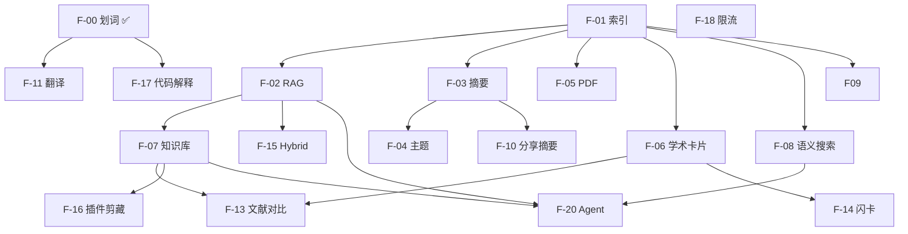

# 网盘 AI 功能需求文档（PRD）

> 版本：v1.0  
> 日期：2026-07-08  
> 状态：已评审（待执行）  
> 关联：`file_management_backend_nest` + `file_management_frontend`  
> 技术路线详案：[2026-07-08-ai-capability-roadmap-design.md](./2026-07-08-ai-capability-roadmap-design.md)  
> 首期实施：[2026-07-09-s12-ai-index-rag-implementation.md](./2026-07-09-s12-ai-index-rag-implementation.md)

---

## 1. 文档目的

本文档将网盘 AI 相关功能 **产品化**：每项功能包含 **需求说明、技术方案、验收标准、完成后收益**，并按 **业务价值 × 实现难度** 排出优先级，作为接下来 2～3 个月的主攻清单。

### 1.1 范围

| 在范围内 | 不在范围内 |
|----------|------------|
| 基于现有网盘的 AI 能力扩展 | 自训模型 / Fine-tuning |
| 复用 Nest + BullMQ + Prisma + Vue3 | 独立 AI 产品（另起项目） |
| 与文件、标签、分享、VIP 集成 | 多模态 OCR/识图（列为远期） |

### 1.2 评分说明

| 维度 | 分制 | 含义 |
|------|------|------|
| **价值** | 1～5 | 5 = 对用户体验 / 简历面试 / 产品差异化最高 |
| **难度** | 1～5 | 5 = 开发量最大、依赖最多、风险最高 |
| **优先级** | P0～P4 | 综合排序，P0 必须先做 |

**优先级规则（简版）：**

- **P0**：地基或已完成，不做则后续全 blocked  
- **P1**：高价值、难度可控，主版本必做  
- **P2**：高价值但依赖 P1，或中等价值低成本  
- **P3**：锦上添花 / Demo 向  
- **P4**：远期探索，暂不排期  

---

## 2. 总体架构

### 2.1 能力分层

```
┌─────────────────────────────────────────────────────────────┐
│ L4  应用层：知识库 / Agent / 插件剪藏 / 分享摘要 / VIP 配额   │
├─────────────────────────────────────────────────────────────┤
│ L3  任务层：摘要 / 主题分析 / 学术卡片 / 自动标签 / 对比       │
├─────────────────────────────────────────────────────────────┤
│ L2  检索层：Embedding / Top-K RAG / Hybrid 搜索 / 引用溯源    │
├─────────────────────────────────────────────────────────────┤
│ L1  索引层：文本提取 / 分块 / 异步 Worker / 进度与状态         │
├─────────────────────────────────────────────────────────────┤
│ L0  基础层：划词问答 / 流式 / Abort / 鉴权 / 限流（部分已有）   │
└─────────────────────────────────────────────────────────────┘
```

**原则：** 上层功能 **复用下层**，不重复造 chunk/embedding 轮子。

### 2.2 统一技术栈

| 层级 | 技术 | 说明 |
|------|------|------|
| LLM 调用 | `ai` v7 + `@ai-sdk/openai` | 已有；兼容 DeepSeek API |
| 流式 | `streamText` + fetch ReadableStream | 前后端统一 |
| 结构化输出 | `generateObject` + Zod | 学术卡片、标签建议 |
| 向量 | Embedding API + MySQL JSON 存向量 | MVP；量大迁 pgvector/Qdrant |
| 异步 | BullMQ + `worker.main.ts` | 索引、摘要、批量任务 |
| 存储 | StorageService + MinIO/本地 | 读文件内容 |
| 缓存/限流 | Redis + express-rate-limit 模式 | AI 日配额 |
| 前端 | Vue3 + Element Plus + Pinia | Tab / 对话 / 卡片 UI |
| 测试 | Jest e2e + `jest.mock('ai')` | 不依赖真实 API Key |

### 2.3 统一环境变量

```env
AI_API_KEY=
AI_BASE_URL=https://api.deepseek.com
AI_MODEL=deepseek-chat
AI_EMBEDDING_MODEL=text-embedding-3-small
AI_MAX_INDEX_CHUNKS=500
AI_DAILY_ASK_LIMIT=100
```

---

## 3. 功能需求明细

---

### F-00 划词流式问答（线 A）

| 项 | 内容 |
|----|------|
| **优先级** | P0（✅ 已完成，S3） |
| **价值** | 4 |
| **难度** | 2 |

**需求描述**  
用户在文件预览中选中一段文字，针对选中内容多轮提问，流式返回答案。

**技术方案**  
- 后端：`FilesAiService.streamText` + System Prompt 注入 `selectedText`  
- 前端：`fetch` + `getReader` + `AbortController`  
- API：`POST /api/files/:id/ai/ask`

**怎么做**  
已实现，后续仅维护兼容性；新 AI 功能不得破坏此端点。

**验收标准**  
- e2e `files-ai.e2e-spec.ts` 全绿  
- 流式 text/plain、client 断开 abort  

**完成后收益**  
- 基础 AI 阅读体验  
- 简历可写「LLM 流式接入 + Prompt 约束防幻觉」  

---

### F-01 单文件文档索引（线 B 地基）

| 项 | 内容 |
|----|------|
| **优先级** | P0 |
| **价值** | 5 |
| **难度** | 3 |
| **代号** | S12 |
| **工期** | 5～7 天 |

**需求描述**  
用户对单个文本文件（TXT/MD）触发「建立 AI 索引」，系统异步完成：文本提取 → 分块 → Embedding 入库，并展示进度。

**技术方案**  
- 表：`DocumentIndexJob`、`DocumentChunk`（embedding 存 JSON）  
- 模块：`text-extractor.ts`、`text-chunker.ts`、`embedding.provider.ts`  
- Queue：`document-index` Processor  
- API：`POST /api/files/:id/ai/index`、`GET .../ai/index/status`

**怎么做**  
1. Prisma 迁移 + Worker 注册  
2. 从 Storage 读 UTF-8 文本，800 字/块、overlap 100  
3. 批量调用 Embedding API 写回 chunk  
4. 更新 job progress 0→100  
5. 前端：索引按钮 + 状态轮询  

**验收标准**  
- 上传 >5KB txt → index → status=ready，DB 有 chunks 且 embedding 非空  
- 重复 index 行为明确（409 或 reindex 参数）  
- e2e mock embedding 通过  

**完成后收益**  
- **所有高级 AI 的地基**（RAG、知识库、语义搜索）  
- 面试核心：**离线索引流水线 + 异步 Worker**  
- 简历：「BullMQ 文档索引、分块 Embedding」  

---

### F-02 单文件 RAG 问答（线 B）

| 项 | 内容 |
|----|------|
| **优先级** | P0 |
| **价值** | 5 |
| **难度** | 3 |
| **代号** | S12 |
| **依赖** | F-01 |

**需求描述**  
索引完成后，用户无需选中文字，直接对 **整份文件** 提问；系统检索相关 chunk，增强 Prompt 后流式回答。

**技术方案**  
- `FilesAiRagService`：embed(question) → cosine Top-K（K=6）→ RAG Prompt → `streamText`  
- API：`POST /api/files/:id/ai/rag-ask`  
- Prompt：「仅根据检索片段回答，不足则说明不知道」

**怎么做**  
1. 校验 index status=ready  
2. 实现 `similarity.util.ts` cosine Top-K  
3. 复用划词流的流式响应与 abort 逻辑  
4. 前端：文件详情「文档问答」Tab  

**验收标准**  
- 问与文件内容相关问题，回答包含片段信息  
- 未索引时返回明确错误  
- e2e 流式 + mock 通过  

**完成后收益**  
- 具备完整 **RAG 闭环**，JD「RAG」关键词覆盖  
- 与划词形成互补：精读 vs 通读  

---

### F-03 长文档分层摘要（线 B）

| 项 | 内容 |
|----|------|
| **优先级** | P1 |
| **价值** | 5 |
| **难度** | 4 |
| **代号** | S13 |
| **依赖** | F-01 |
| **工期** | 5～7 天 |

**需求描述**  
对长文本（小说、报告）生成：**块摘要 → 章摘要 → 全书摘要**，结果预存库；用户查看摘要时不实时跑全书。

**技术方案**  
- 表：`DocumentSummary`（type: chunk/chapter/book）  
- Worker 扩展：Map-Reduce 调 LLM  
- API：`GET /api/files/:id/ai/summary?type=book|chapter&chapterNo=`  

**怎么做**  
1. chunk 摘要（Map）  
2. 按 chapterNo 或 batch 合并（Reduce）  
3. 全书摘要再 Reduce；超长则 batch 递归  
4. 前端：摘要 Tab + 下拉选章节  

**验收标准**  
- 3 章 mock 长文可生成 book summary  
- 二次请求读库，不重复调 LLM（除非 reindex）  

**完成后收益**  
- 覆盖「百万字总结」类场景与面试题  
- 讲清 **RAG vs 摘要分工**（总结走摘要层，细节走 RAG）  

---

### F-04 主题 / 宏观分析（线 B）

| 项 | 内容 |
|----|------|
| **优先级** | P1 |
| **价值** | 4 |
| **难度** | 3 |
| **代号** | S13 |
| **依赖** | F-03 |

**需求描述**  
对小说/长报告分析 **主题、母题**（非单一事实问答），基于摘要层而非原文 RAG。

**技术方案**  
- 输入：`book` + `chapter` 摘要  
- API：`POST /api/files/:id/ai/analyze { type: 'theme' }`，可流式  
- 输出：3～5 主题 + 各主题依据（来自哪章摘要）  

**怎么做**  
1. 读取 `DocumentSummary`  
2. Theme Prompt 约束「依据摘要、不编造情节」  
3. 可选写入 summary type=theme  

**验收标准**  
- 《哈利波特》类 mock 文本可输出主题列表  
- 不依赖实时 RAG 扫全书  

**完成后收益**  
- 产品差异化：「读完全书的大纲感」  
- 面试展示对 LLM 任务分流的理解  

---

### F-05 PDF 文本索引

| 项 | 内容 |
|----|------|
| **优先级** | P1 |
| **价值** | 4 |
| **难度** | 3 |
| **代号** | S13 |
| **依赖** | F-01 |

**需求描述**  
支持 **文字层 PDF** 建立索引（与 TXT/MD 同一套 pipeline）。

**技术方案**  
- `text-extractor` 扩展：pdf-parse 或复用预览链路抽文本  
- 仅处理可选中文字的 PDF；扫描件返回友好错误  

**怎么做**  
1. mime/扩展名判断  
2. 提取纯文本后走 F-01 流程  
3. e2e 1 例小 PDF  

**验收标准**  
- 文字 PDF index → rag-ask 可用  
- 扫描 PDF 提示不支持  

**完成后收益**  
- 学术/办公场景可用性大幅提升  

---

### F-06 学术文献知识点卡片（线 C）

| 项 | 内容 |
|----|------|
| **优先级** | P1 |
| **价值** | 5 |
| **难度** | 4 |
| **代号** | S14 |
| **依赖** | F-01、F-05（PDF 可选） |
| **工期** | 5～7 天 |

**需求描述**  
上传论文（PDF/MD），按 **Abstract/Method/Results** 等结构抽取结构化知识：贡献、方法、结论、定义、局限等，以卡片 UI 展示。

**技术方案**  
- 表：`DocumentKnowledge`（payload JSON）  
- `indexMode=academic`：section-aware 分块  
- `generateObject` + Zod schema，**分 section 独立抽取** 再 merge  
- API：`GET /api/files/:id/ai/knowledge`  

**怎么做**  
1. 定义 `KnowledgeCardSchema`（见路线图 §5.1）  
2. 正则/Markdown 标题识别 section  
3. Worker：extract_knowledge 步骤  
4. 前端：Descriptions / Collapse 卡片  

**验收标准**  
- mock 论文 JSON 含 contributions、keyFindings（带 section）  
- 无编造字段（空则 null）  

**完成后收益**  
- 覆盖「读期刊凝练知识点」场景  
- 简历：**structured output + 学术场景**  
- 与通用 RAG 形成第三条产品线  

---

### F-07 知识库（多文档 RAG + 会话）

| 项 | 内容 |
|----|------|
| **优先级** | P1 |
| **价值** | 5 |
| **难度** | 4 |
| **代号** | S16 |
| **依赖** | F-01、F-02 |
| **工期** | 7～10 天 |

**需求描述**  
用户创建「知识库」，从网盘添加多个文件；对 **整个库** 提问，回答 **跨文档** 并 **引用来源文件+段落**，支持多轮会话。

**技术方案**  
- 表：`KnowledgeBase`、`KnowledgeBaseItem`、`KnowledgeBaseSession`、`KnowledgeBaseMessage`  
- **复用** `DocumentChunk`：KB 只维护 fileId 集合，不重复 embedding  
- 检索：`WHERE userFileId IN (kb items)` → Top-K  
- API：  
  - `POST/GET/PATCH/DELETE /api/knowledge-bases`  
  - `POST /api/knowledge-bases/:id/items`  
  - `POST /api/knowledge-bases/:id/chat`（流式 + citations JSON）  

**怎么做**  
1. KB CRUD + 添加/移除 fileIds  
2. 聚合子文件 index 状态（全 ready 才可问）  
3. rag-ask 逻辑泛化：多 fileId 范围检索  
4. citations 结构 `{ fileId, fileName, chunkIndex, excerpt }`  
5. 前端：KB 列表 + 详情（左文件列表 / 右对话）  
6. 点击 citation 跳转文件预览  

**验收标准**  
- 2 个已索引文件入 KB，跨文件问题返回答案 + ≥1 source  
- 会话历史可查看  
- 未索引文件提示先索引  

**完成后收益**  
- **杀手级功能**：从「单文件 AI」升级为「个人知识管理」  
- 面试完整 story：「单文件 index 一次，KB 是多文件检索视图」  
- 最接近 Dify/飞书知识库的产品叙事  

---

### F-08 语义搜索（自然语言找文件）

| 项 | 内容 |
|----|------|
| **优先级** | P2 |
| **价值** | 4 |
| **难度** | 2 |
| **代号** | S16b |
| **依赖** | F-01 |

**需求描述**  
网盘搜索框支持语义查询，如「去年关于 Nest 迁移的笔记」，返回相关 **文件列表**（非对话）。

**技术方案**  
- 对已索引文件：embed(query) → 各文件 top chunk score 聚合为 file score → 排序  
- 未索引文件：fallback 现有文件名搜索  
- API：`GET /api/files/search?q=&mode=semantic`  

**怎么做**  
1. 文件级 score = max(chunk similarity) 或 avg top3  
2. 与 keyword 搜索 merge 排名（可选）  
3. 前端搜索模式切换  

**验收标准**  
- 语义相近但文件名不含关键词的文件可被找到  

**完成后收益**  
- 日常网盘体验提升  
- F-01 索引的直接产品化出口  

---

### F-09 AI 自动打标签

| 项 | 内容 |
|----|------|
| **优先级** | P2 |
| **价值** | 4 |
| **难度** | 2 |
| **代号** | S16b |
| **依赖** | F-01 或 F-03 |

**需求描述**  
文件索引完成后，AI 建议 3～5 个标签；用户一键采纳或忽略。

**技术方案**  
- `generateObject`：`{ tags: string[] }`  
- 输入：文件名 + 前 2KB 文本或 chunk 摘要  
- 对接现有 `FileTag` / `UserFileTag`  
- 可选：上传完成后 Worker 异步建议  

**怎么做**  
1. API：`GET /api/files/:id/ai/suggested-tags`  
2. `POST` 采纳：`{ tagNames: [] }`  
3. 前端：标签推荐 chips  

**验收标准**  
- 技术类 txt 建议合理标签  
- 不自动写入，需用户确认  

**完成后收益**  
- 低成本高感知 AI 功能  
- 体现与现有标签体系集成能力  

---

### F-10 分享链接 AI 摘要

| 项 | 内容 |
|----|------|
| **优先级** | P2 |
| **价值** | 4 |
| **难度** | 2 |
| **代号** | S16c |
| **依赖** | F-03 或 F-01 |

**需求描述**  
外链分享页展示「这份文件讲什么」短摘要（200 字），访客无需登录即可看摘要（不含完整 AI 问答）。

**技术方案**  
- 读 `DocumentSummary` type=book 或现场 generate 缓存  
- 分享 token 校验后返回摘要  
- API：`GET /api/share/:token/ai-summary`  

**怎么做**  
1. 分享创建时可选「生成 AI 摘要」  
2. 无摘要则提示文件所有者先索引  
3. 前端分享页顶部摘要卡片  

**验收标准**  
- 有效 share token 返回摘要  
- 无 token / 过期 401  

**完成后收益**  
- 与现有 Share 模块深度结合  
- 社交传播场景差异化  

---

### F-11 划词翻译

| 项 | 内容 |
|----|------|
| **优先级** | P2 |
| **价值** | 3 |
| **难度** | 1 |
| **代号** | S16c |
| **依赖** | F-00 |

**需求描述**  
预览中选中外文，一键翻译为中文（或指定语言）。

**技术方案**  
- 复用 chrome-ai-extension 的 `generateText` 翻译 Prompt  
- API：`POST /api/files/:id/ai/translate { text, targetLang }`  
- 非流式，短文本  

**怎么做**  
1. 从 extension 移植 prompt  
2. 前端预览工具栏加「翻译」  

**验收标准**  
- 英文段落返回中文译文  
- 超长文本截断提示  

**完成后收益**  
- 1 天内可交付的小功能  
- 与插件能力统一叙事  

---

### F-12 文档版本对比 + AI 解读

| 项 | 内容 |
|----|------|
| **优先级** | P2 |
| **价值** | 4 |
| **难度** | 3 |
| **代号** | S17 |
| **依赖** | 现有 `files-version` 模块 |

**需求描述**  
用户选择文件两个版本，系统 diff 后由 AI 用自然语言说明「改了什么、可能影响什么」。

**技术方案**  
- 文本 diff（diff 库或行级对比）  
- LLM 输入：diff hunks + 限制长度  
- API：`POST /api/files/:id/ai/version-compare { versionA, versionB }`  

**怎么做**  
1. 读两版本 storage 文本  
2. 生成 unified diff  
3. Prompt：「仅根据 diff 总结变更，分点列出」  

**验收标准**  
- 修改过段落的两版 txt 可产出变更说明  

**完成后收益**  
- 深度复用已有版本模块  
- 合同/笔记场景实用  

---

### F-13 文献对比矩阵（多篇论文）

| 项 | 内容 |
|----|------|
| **优先级** | P2 |
| **价值** | 5 |
| **难度** | 4 |
| **代号** | S17 |
| **依赖** | F-06、F-07 |

**需求描述**  
在知识库（或手动选 N 篇论文）生成对比表：方法、数据集、指标、结论差异。

**技术方案**  
- 每篇已有 `DocumentKnowledge` JSON  
- 服务端 merge 为矩阵；缺失字段标「—」  
- 可选 LLM 生成「综合评述」一段  
- API：`POST /api/knowledge-bases/:id/ai/compare-papers`  

**怎么做**  
1. 校验 KB 内文件均为 academic 且已有 knowledge  
2. 表格字段对齐 schema  
3. 前端 Table 组件展示  

**验收标准**  
- 2 篇 mock 论文生成对比表  

**完成后收益**  
- 学术场景强差异化  
- 面试可展开「structured data aggregation」  

---

### F-14 闪卡 / 复习提纲生成

| 项 | 内容 |
|----|------|
| **优先级** | P3 |
| **价值** | 3 |
| **难度** | 2 |
| **代号** | S17 |
| **依赖** | F-06 |

**需求描述**  
从学术论文知识点生成 Q/A 闪卡或复习提纲，可导出 Markdown。

**技术方案**  
- 输入：`DocumentKnowledge.definitions` + keyFindings  
- `generateObject`：`{ cards: [{ front, back }] }`  
- API：`GET /api/files/:id/ai/flashcards`  

**验收标准**  
- 至少 5 张卡片，front/back 非空  

**完成后收益**  
- 学习场景延伸，Demo 效果好  

---

### F-15 Hybrid 检索（向量 + 关键词）

| 项 | 内容 |
|----|------|
| **优先级** | P3 |
| **价值** | 3 |
| **难度** | 3 |
| **代号** | S13 可选 |
| **依赖** | F-02 |

**需求描述**  
RAG 检索时对专名、术语、Table 编号等 **关键词加权**，减少纯向量漏检。

**技术方案**  
- MySQL FULLTEXT 或 LIKE 预筛 + 向量 rerank  
- 或 RRF（Reciprocal Rank Fusion）合并两路结果  

**验收标准**  
- 含「Theorem 3.2」类查询命中正确 chunk  

**完成后收益**  
- 学术 RAG 质量提升  
- 面试可讲 hybrid search  

---

### F-16 插件网页剪藏 → 知识库

| 项 | 内容 |
|----|------|
| **优先级** | P3 |
| **价值** | 5 |
| **难度** | 4 |
| **代号** | 跨项目 |
| **依赖** | F-07、chrome-ai-extension |

**需求描述**  
浏览器插件选中网页内容，一键保存为网盘 MD 并加入指定知识库、触发索引。

**技术方案**  
- Extension：`POST /api/files/upload` + `POST /api/knowledge-bases/:id/items`  
- 共用 Nest AI 后端与 JWT  
- 可选：只存选中 HTML→Markdown  

**验收标准**  
- 插件剪藏 → 网盘可见 → KB 可问答  

**完成后收益**  
- **两项目串联**，简历极独特  
- 完整「采集 → 索引 → 问答」闭环  

---

### F-17 代码文件 AI 解释

| 项 | 内容 |
|----|------|
| **优先级** | P3 |
| **价值** | 3 |
| **难度** | 1 |
| **依赖** | F-00 |

**需求描述**  
预览 `.ts/.js` 等代码文件时，选中代码块解释含义。

**技术方案**  
- 复用 F-00，`fileName` 传入 + System Prompt 改为代码助手  
- 可选：检测 `mediaFileDetect` 代码类型  

**验收标准**  
- 选中函数可得到解释  

**完成后收益**  
- 几乎零成本扩展  

---

### F-18 AI 限流与 VIP 配额

| 项 | 内容 |
|----|------|
| **优先级** | P1 |
| **价值** | 4 |
| **难度** | 2 |
| **代号** | S15 |
| **依赖** | 任一 AI 调用 |

**需求描述**  
按用户限制每日 AI 请求次数、单文件 index 体积；VIP 提高配额。

**技术方案**  
- Redis INCR `ai:quota:{userId}:{date}`  
- Guard 或 Service 层校验  
- 对接现有 `VipModule`  

**验收标准**  
- 超配额返回 429 + 友好文案  
- VIP 用户限额更高  

**完成后收益**  
- 生产可控、成本可控  
- 与商业模型（VIP）挂钩  

---

### F-19 工程化：CI + README + 文章

| 项 | 内容 |
|----|------|
| **优先级** | P1 |
| **价值** | 4 |
| **难度** | 2 |
| **代号** | S15 |

**需求描述**  
AI 功能可对外展示：CI 跑 Nest e2e、README 架构图、1 篇技术文章。

**技术方案**  
- 更新 `.github/workflows/backend-ci.yml` → `file_management_backend_nest`  
- README Document Intelligence 章节  
- 掘金/知乎文章  

**完成后收益**  
- 求职可见性 **不低于功能本身**  

---

### F-20 网盘 Agent（工具调用）

| 项 | 内容 |
|----|------|
| **优先级** | P4 |
| **价值** | 5 |
| **难度** | 5 |
| **代号** | S18 |
| **依赖** | F-02、F-07、F-08 |

**需求描述**  
自然语言指令：「把我标签为论文的文件总结成 500 字发消息给张三」——Agent 多步调用工具。

**技术方案**  
- Vercel AI SDK `tools`：searchFiles、readSummary、sendMessage…  
- 多轮 tool call + 最终回复  

**怎么做（远期）**  
先实现 2～3 个 tool 的 manual 编排，再 Agent 化。

**完成后收益**  
- JD「Agent」关键词  
- 难度高，排最后  

---

### F-21～F-24 远期（仅记录，不排期）

| ID | 功能 | 价值 | 难度 | 说明 |
|----|------|------|------|------|
| F-21 | 人物关系图（小说） | 3 | 5 | 实体抽取 + 图可视化 |
| F-22 | OCR 扫描件 | 3 | 4 | 第三方 OCR API |
| F-23 | 聊天 @AI 助手 | 2 | 3 | Message + Socket 流式 |
| F-24 | MCP 暴露网盘 | 2 | 3 | 给 Cursor 读文件，极客向 |

---

## 4. 优先级总表（按执行顺序）

| 顺序 | ID | 功能 | 优先级 | 价值 | 难度 | 综合建议 |
|------|-----|------|--------|------|------|----------|
| — | F-00 | 划词问答 | P0 | 4 | 2 | ✅ 已完成 |
| 1 | F-01 | 单文件索引 | P0 | 5 | 3 | **立刻做** |
| 2 | F-02 | 单文件 RAG | P0 | 5 | 3 | 与 F-01 同批 S12 |
| 3 | F-03 | 分层摘要 | P1 | 5 | 4 | S13 |
| 4 | F-04 | 主题分析 | P1 | 4 | 3 | S13 |
| 5 | F-05 | PDF 索引 | P1 | 4 | 3 | S13 |
| 6 | F-06 | 学术知识卡片 | P1 | 5 | 4 | S14 |
| 7 | F-18 | AI 限流/VIP | P1 | 4 | 2 | S15，可与 S14 并行 |
| 8 | F-19 | CI/文章/简历 | P1 | 4 | 2 | S15 |
| 9 | F-07 | **知识库** | P1 | 5 | 4 | **S16 核心** |
| 10 | F-08 | 语义搜索 | P2 | 4 | 2 | S16b |
| 11 | F-09 | 自动打标签 | P2 | 4 | 2 | S16b |
| 12 | F-10 | 分享 AI 摘要 | P2 | 4 | 2 | S16c |
| 13 | F-11 | 划词翻译 | P2 | 3 | 1 | S16c，快速 win |
| 14 | F-12 | 版本对比 AI | P2 | 4 | 3 | S17 |
| 15 | F-13 | 文献对比矩阵 | P2 | 5 | 4 | S17 |
| 16 | F-15 | Hybrid 检索 | P3 | 3 | 3 | 按需 |
| 17 | F-14 | 闪卡生成 | P3 | 3 | 2 | 按需 |
| 18 | F-17 | 代码解释 | P3 | 3 | 1 | 顺手做 |
| 19 | F-16 | 插件剪藏→KB | P3 | 5 | 4 | 有精力再做 |
| 20 | F-20 | 网盘 Agent | P4 | 5 | 5 | 远期 |

---

## 5. 价值-难度矩阵（可视化）

```
价值 5 │  F-01 F-02 F-07 F-06 F-13        F-20
       │  F-03              F-16
价值 4 │  F-04 F-05 F-08 F-09 F-10 F-12 F-18 F-19
价值 3 │  F-11 F-14 F-15 F-17    F-21 F-22
价值 2 │                          F-23 F-24
       └────────────────────────────────────────→ 难度
         1    2    3    4    5
```

**优先做右上象限的「高价值、中低难度」：** F-08、F-09、F-10、F-11、F-18  
**高价值高难度必做但排在地基后：** F-01～F-07、F-06  

---

## 6. 推荐排期（约 10 周）

| 周次 | 日期参考 | 交付功能 | 里程碑 |
|------|----------|----------|--------|
| W1 | 07-09～07-15 | F-01、F-02（S12） | 单文件 RAG 可演示 |
| W2 | 07-16～07-22 | F-03、F-04、F-05（S13） | 长文档摘要+PDF |
| W3 | 07-23～07-29 | F-06（S14） | 论文知识卡片 |
| W4 | 07-30～08-05 | F-18、F-19（S15） | 限流+CI+文章 |
| W5～6 | 08-06～08-19 | F-07（S16） | **知识库上线** |
| W7 | 08-20～08-26 | F-08、F-09、F-11 | 搜索+标签+翻译 |
| W8 | 08-27～09-02 | F-10、F-12 | 分享摘要+版本对比 |
| W9 | 09-03～09-09 | F-13 | 文献对比矩阵 |
| W10 | 缓冲 / F-16 / F-17 | 插件联动或打磨 Demo | 录屏+投递 |

---

## 7. 模块依赖图



---

## 8. 完成后整体收益（项目级）

| 维度 | 收益 |
|------|------|
| **产品** | 从「存文件」升级为「Document Intelligence 网盘」：读、问、总结、知识库 |
| **简历** | 可写 RAG、Map-Reduce 摘要、structured output、BullMQ 索引、知识库 citation |
| **面试** | 3 分钟 Demo + 架构分层讲解；覆盖 JD 中 AI/RAG/Agent/工程化 关键词 |
| **技术深度** | 不偏离主栈（Nest/Vue），AI 作为垂直增强 |
| **差异化** | 比纯 CRUD 网盘多一条完整 AI 故事线；比纯 ChatBot demo 多真实文件场景 |

**建议对外主打叙事（一句话）：**

> 自研网盘 + Document Intelligence：单文件划词/RAG/摘要/学术卡片，多文档知识库跨库问答与溯源，BullMQ 离线索引，Nest 流式 AI SDK 全链路。

---

## 9. 文档与实施索引

| 文档 | 内容 |
|------|------|
| 本文 PRD | 全功能需求 + 优先级 |
| [2026-07-08-ai-capability-roadmap-design.md](./2026-07-08-ai-capability-roadmap-design.md) | 技术架构 + 表结构 + API |
| [2026-07-09-s12-ai-index-rag-implementation.md](./2026-07-09-s12-ai-index-rag-implementation.md) | W1 执行 Task 清单 |

**下一步行动：** 按 W1 启动 S12（F-01 + F-02），不必并行开 F-07 知识库，等地基 ready 后再做 S16。

---

## 10. 修订记录

| 版本 | 日期 | 说明 |
|------|------|------|
| v1.0 | 2026-07-08 | 初版：24 项功能需求 + 10 周排期 |
