# 网盘 AI 功能需求文档（PRD）

> 版本：v1.26  
> 日期：2026-07-08（S13～S19 更新见修订记录；**本批确认 F-30+搜图+查重：2026-07-20**；**F-40 整理文件夹远期：2026-07-20**；**F-30 ✅ 2026-07-21**）  
> 状态：执行中（… **S19 F-29 ✅**；**S18b F-30 ✅**；**F-18 ⏸**；插件⏸；**下一批：F-38 → F-39 → F-35**；**远期：F-40 / F-20**）  
> 关联：`file_management_backend_nest` + `file_management_frontend`  
> 技术路线详案：[2026-07-08-ai-capability-roadmap-design.md](./2026-07-08-ai-capability-roadmap-design.md)  
> 首期实施：[2026-07-09-s12-ai-index-rag-implementation.md](./2026-07-09-s12-ai-index-rag-implementation.md)  
> S13 实施：[2026-07-09-s13-ai-summary-implementation.md](./2026-07-09-s13-ai-summary-implementation.md)  
> F-06 笔记：[2026-07-12-F06-学术知识卡片-学习笔记与架构讨论.md](../knowledge/2026-07-12-F06-学术知识卡片-学习笔记与架构讨论.md)  
> F-07 笔记：[2026-07-14-F07-知识库-学习笔记.md](../knowledge/2026-07-14-F07-知识库-学习笔记.md)  
> F-08 方案：[2026-07-17-F08-语义搜索-实现方案.md](./2026-07-17-F08-语义搜索-实现方案.md)  
> F-11 方案：[2026-07-16-F11-划词翻译-实现方案.md](./2026-07-16-F11-划词翻译-实现方案.md)  
> F-26 方案：[2026-07-18-F26-图片可索引-实现方案.md](./2026-07-18-F26-图片可索引-实现方案.md)  
> F-27 约定：[2026-07-18-F27-截图数学解题-产品约定.md](./2026-07-18-F27-截图数学解题-产品约定.md)  
> F-27 方案：[2026-07-18-F27-截图数学解题-实现方案.md](./2026-07-18-F27-截图数学解题-实现方案.md)  
> F-29 方案：[2026-07-19-F29-错题本-实现方案.md](./2026-07-19-F29-错题本-实现方案.md)  
> 插件 + 会话落盘（⏸ 押后）：[2026-07-19-浏览器插件与会话落盘-实现方案.md](./2026-07-19-浏览器插件与会话落盘-实现方案.md)  
> **本批实现方案：** [2026-07-20-多模态检索与查重-F30扫描PDF-实现方案.md](./2026-07-20-多模态检索与查重-F30扫描PDF-实现方案.md)  
> 视觉概念：[2026-07-17-视觉-OCR-VL-CLIP-学习笔记.md](../knowledge/2026-07-17-视觉-OCR-VL-CLIP-学习笔记.md)  
> F-27 概念：[2026-07-18-F27-VL-SSE-KaTeX-学习笔记.md](../knowledge/2026-07-18-F27-VL-SSE-KaTeX-学习笔记.md)  

---

## 1. 文档目的

本文档将网盘 AI 相关功能 **产品化**：每项功能包含 **需求说明、技术方案、验收标准、完成后收益**，并按 **业务价值 × 实现难度** 排出优先级，作为接下来 2～3 个月的主攻清单。

### 1.1 范围

| 在范围内 | 不在范围内 |
|----------|------------|
| 基于现有网盘的 AI 能力扩展 | 自训模型 / Fine-tuning |
| 复用 Nest + BullMQ + Prisma + Vue3 | 独立 AI 产品（另起项目） |
| 与文件、标签、分享、VIP 集成 | 自训 VL / 本地部署视觉模型 |
| 网盘内视频/音频 ASR + 结构化摘要（F-25） | 外部视频链接（YouTube/B 站，列为 F-25 二期） |
| **视觉线（S18+）：图片/扫描 PDF、截图解题、错题本、以图/以文搜图、近似查重等** | 实时摄像头拍题、医学/法律级 OCR、独立商用向量集群（MVP 仍用 MySQL JSON） |

### 1.2 评分说明

| 维度 | 分制 | 含义 |
|------|------|------|
| **价值** | 1～5 | 5 = 对用户体验 / 简历面试 / 产品差异化最高 |
| **难度** | 1～5 | 5 = 开发量最大、依赖最多、风险最高 |
| **工期** | 人天 | 单人全职开发预估；同迭代内多项可并行，周合计可能大于 7 天 |
| **优先级** | P0～P4 | 综合排序，P0 必须先做 |

**优先级规则（简版）：**

- **P0**：地基或已完成，不做则后续全 blocked  
- **P1**：高价值、难度可控，主版本必做  
- **P2**：高价值但依赖 P1，或中等价值低成本  
- **P3**：锦上添花 / Demo 向  
- **P4**：远期探索，暂不排期  

### 1.3 下一阶段确认清单（2026-07-20 更新）

> **上一批已交付：** F-05、F-06、F-07 / F-11、F-08、**F-26**、**F-27**、**F-29**；预览会话落盘 / temp API 已落地；**浏览器插件押后**。  
> **本批（面试向，约 3～4 周）：** **F-30 → F-38 → F-39 → F-35**。  
> **原则：** **指纹 Job（轻）** 与 **RAG「建立索引」（重）分轨**——查重/搜图不要求先点建立索引；**不**默认上传即自动完整 RAG 索引。详案见 [2026-07-20 实现方案](./2026-07-20-多模态检索与查重-F30扫描PDF-实现方案.md)。  
> **F-18 延后说明：** 单人自用暂不控成本；开放/上线前再补。

| 顺序 | ID | 功能 | 代号 | 建议工期 | 说明 |
|------|-----|------|------|----------|------|
| — | … | 既有交付（F-05～F-29 等） | — | — | ✅ 见总表 |
| — | **F-18** | **AI 限流与 VIP 配额** | **S15** | 2～3 天 | ⏸ **延后** |
| **1** | **F-30** | **扫描 PDF 可索引** | **S18b** | 3～5 天 | ✅ **已完成**（2026-07-21） |
| **2** | **F-38** | **以图搜图** | **S21a** | 4～6 天 | 🔜 CLIP 图像向量 + Top-K（含基建） |
| **3** | **F-39** | **以文搜图** | **S21b** | 1～2 天 | 🔜 CLIP 文本塔；搜索 UI 与 F-08 分区 |
| **4** | **F-35** | **近似文件查重** | **S20** | 4～6 天 | 🔜 **升级**：跨文本+图片；独立页；分组多选手动删 |

**文档语义搜索（各类文本）：** 复用已交付 **F-08**，本批在搜索入口与 F-39 图片结果分区展示，不另立 ID。  

**本批合计：** 约 **14～18 人天（3～4 周）**。  
**本批不包含：** 插件 C、上传自动 RAG、PDF 页级搜图、pgvector、F-31～F-33 / F-36 / F-37、**F-40 AI 整理文件夹 / F-20 Agent（远期）**。

### 1.4 视觉线确认清单（2026-07-20 更新）

> **策略：** 文本摘要 / RAG / 知识卡继续 DeepSeek；**索引 OCR** 用硅基 DeepSeek-OCR；**截图解题** 用 Qwen3-VL；**搜图** 用 CLIP 类图文 embedding（与文本 RAG 向量空间分离）。  
> **本批 🔜：** F-30 → F-38 → F-39 → F-35。  
> **其后：** F-31 → F-32 → F-33 → F-36 → F-37。

| 阶段 | 顺序 | ID | 功能 | 代号 | 建议工期 | 说明 |
|------|------|-----|------|------|----------|------|
| **已交付** | — | **F-26** | 图片可索引 | **S18a** | 2～3 天 | ✅ OCR → RAG；划词面板 |
| | — | **F-27** | 截图数学解题 | **S18c** | 3～4 天 | ✅ VL 流式解题 |
| | — | **F-29** | 错题本 | **S19** | 4～5 天 | ✅ 持久化 + 筛选 + 刷题 |
| **本批 🔜** | 1 | **F-30** | 扫描 PDF 可索引 | **S18b** | 3～5 天 | 🔜 渲页 + OCR → index → 问答/摘要 |
| | 2 | **F-38** | 以图搜图 | **S21a** | 4～6 天 | 🔜 图像向量库（MVP=MySQL JSON） |
| | 3 | **F-39** | 以文搜图 | **S21b** | 1～2 天 | 🔜 文→图；与 F-08 同入口分区 |
| | 4 | **F-35** | 近似文件查重 | **S20** | 4～6 天 | 🔜 指纹近重 + 独立页多选删 |
| **其后** | — | **F-31～F-33、F-36、F-37** | … | … | … | 标签 / 手写 / 读图 / 敏感图 / 分享说明 |

**原 F-22 OCR 扫描件** 已合并进 **F-26 + F-30**，不再单独排期。

---

## 2. 总体架构

### 2.1 能力分层

```
┌─────────────────────────────────────────────────────────────┐
│ L4  应用层：知识库 / Agent / 插件剪藏 / 分享摘要 / VIP 配额   │
├─────────────────────────────────────────────────────────────┤
│ L3  任务层：摘要 / 主题分析 / 学术卡片 / 自动标签 / 对比       │
├─────────────────────────────────────────────────────────────┤
│ L2  检索层：Embedding / Top-K RAG / Hybrid 搜索 / 引用溯源    │
├─────────────────────────────────────────────────────────────┤
│ L1  索引层：文本提取 / 分块 / 异步 Worker / 进度与状态         │
│ L1′ 视觉索引：OCR 图→文 / 扫描 PDF 逐页 OCR（F-26、F-30）      │
├─────────────────────────────────────────────────────────────┤
│ L0  基础层：划词问答 / 流式 / Abort / 鉴权 / 限流（部分已有）   │
│ L0′ 视觉交互：截图解题 / 区域问答（F-27，不进 index Worker）   │
└─────────────────────────────────────────────────────────────┘
```

**原则：** 上层功能 **复用下层**，不重复造 chunk/embedding 轮子。视觉 **索引**（OCR）与 **交互**（VL 解题）分 Service / 分环境变量，Worker 只做「图→文→现有 pipeline」。

### 2.2 统一技术栈

| 层级 | 技术 | 说明 |
|------|------|------|
| LLM 调用 | `ai` v7 + `@ai-sdk/openai` | 已有；兼容 DeepSeek API |
| 流式 | `streamText` + fetch ReadableStream | 前后端统一 |
| 结构化输出 | `generateObject` + Zod | 学术卡片、标签建议 |
| 向量 | Embedding API + MySQL JSON 存向量 | MVP；量大迁 pgvector/Qdrant |
| 异步 | BullMQ + `worker.main.ts` | 索引、摘要、批量任务 |
| 存储 | StorageService + MinIO/本地 | 读文件内容 |
| 缓存/限流 | Redis + express-rate-limit 模式 | AI 日配额 |
| 前端 | Vue3 + Element Plus + Pinia | Tab / 对话 / 卡片 UI |
| 测试 | Jest e2e + `jest.mock('ai')` | 不依赖真实 API Key |

### 2.3 统一环境变量

```env
AI_API_KEY=
AI_BASE_URL=https://api.deepseek.com
AI_MODEL=deepseek-chat
AI_EMBEDDING_MODEL=text-embedding-3-small
AI_MAX_INDEX_CHUNKS=500
AI_DAILY_ASK_LIMIT=100
# 视觉 OCR（F-26 / F-30 索引，硅基流动限免 DeepSeek-OCR）
# AI_VISION_BASE_URL=https://api.siliconflow.cn/v1
# AI_VISION_API_KEY=
# AI_VISION_MODEL=deepseek-ai/DeepSeek-OCR
# 截图解题（F-27 / F-29，按需 VL，与 OCR 分离）
# AI_MATH_VISION_BASE_URL=https://api.siliconflow.cn/v1
# AI_MATH_VISION_API_KEY=
# AI_MATH_VISION_MODEL=Qwen/Qwen3.6-35B-A3B
# 视频/音频转写（F-25，实施时启用）
# AI_ASR_BASE_URL=
# AI_ASR_API_KEY=
# AI_ASR_MODEL=whisper-1
# AI_MAX_VIDEO_DURATION_SEC=5400
```

---

## 3. 功能需求明细

---

### F-00 划词流式问答（线 A）

| 项 | 内容 |
|----|------|
| **优先级** | P0（✅ 已完成，S3） |
| **价值** | 4 |
| **难度** | 2 |
| **工期** | 3～4 天 |
| **状态** | ✅ 已完成（S3） |

**需求描述**  
用户在文件预览中选中一段文字，针对选中内容多轮提问，流式返回答案。

**技术方案**  
- 后端：`FilesAiService.streamText` + System Prompt 注入 `selectedText`  
- 前端：`fetch` + `getReader` + `AbortController`  
- API：`POST /api/files/:id/ai/ask`

**怎么做**  
已实现，后续仅维护兼容性；新 AI 功能不得破坏此端点。

**验收标准**  
- e2e `files-ai.e2e-spec.ts` 全绿  
- 流式 text/plain、client 断开 abort  

**完成后收益**  
- 基础 AI 阅读体验  
- 简历可写「LLM 流式接入 + Prompt 约束防幻觉」  

---

### F-01 单文件文档索引（线 B 地基） ✅ S12 已完成

| 项 | 内容 |
|----|------|
| **优先级** | P0 |
| **价值** | 5 |
| **难度** | 3 |
| **代号** | S12 |
| **工期** | 5～7 天 |
| **状态** | ✅ MVP 已完成（2026-07-09） |

**需求描述**  
用户对单个文本文件（TXT/MD）触发「建立 AI 索引」，系统异步完成：文本提取 → 分块 → Embedding 入库，并展示进度。

**技术方案**  
- 表：`DocumentIndexJob`、`DocumentChunk`（embedding 存 JSON）  
- 模块：`text-extractor.ts`、`text-chunker.ts`、`embedding.provider.ts`  
- Queue：`document-index` Processor  
- API：`POST /api/files/:id/ai/index`、`GET .../ai/index/status`

**怎么做**  
1. Prisma 迁移 + Worker 注册  
2. 从 Storage 读 UTF-8 文本，800 字/块、overlap 100  
3. 批量调用 Embedding API 写回 chunk  
4. 更新 job progress 0→100  
5. 前端：索引按钮 + 状态轮询  

**验收标准**  
- 上传 >5KB txt → index → status=ready，DB 有 chunks 且 embedding 非空  
- 重复 index 行为明确（409 或 reindex 参数）  
- e2e mock embedding 通过  

**完成后收益**  
- **所有高级 AI 的地基**（RAG、知识库、语义搜索）  
- 面试核心：**离线索引流水线 + 异步 Worker**  
- 简历：「BullMQ 文档索引、分块 Embedding」  

---

### F-02 单文件 RAG 问答（线 B） ✅ S12 已完成

| 项 | 内容 |
|----|------|
| **优先级** | P0 |
| **价值** | 5 |
| **难度** | 3 |
| **代号** | S12 |
| **依赖** | F-01 |
| **工期** | 2～3 天（与 F-01 同迭代 S12，合计约 5～7 天） |
| **状态** | ✅ MVP 已完成（2026-07-09） |

**需求描述**  
索引完成后，用户无需选中文字，直接对 **整份文件** 提问；系统检索相关 chunk，增强 Prompt 后流式回答。

**技术方案**  
- `FilesAiRagService`：embed(question) → cosine Top-K（K=6）→ RAG Prompt → `streamText`  
- API：`POST /api/files/:id/ai/rag-ask`  
- Prompt：「仅根据检索片段回答，不足则说明不知道」

**怎么做**  
1. 校验 index status=ready  
2. 实现 `similarity.util.ts` cosine Top-K  
3. 复用划词流的流式响应与 abort 逻辑  
4. 前端：文件详情「文档问答」Tab  

**验收标准**  
- 问与文件内容相关问题，回答包含片段信息  
- 未索引时返回明确错误  
- e2e 流式 + mock 通过  

**完成后收益**  
- 具备完整 **RAG 闭环**，JD「RAG」关键词覆盖  
- 与划词形成互补：精读 vs 通读  

---

### F-03 长文档分层摘要（线 B）

| 项 | 内容 |
|----|------|
| **优先级** | P1 |
| **价值** | 5 |
| **难度** | 4 |
| **代号** | S13 |
| **状态** | ✅ **已完成**（2026-07-10） |
| **依赖** | F-01 |
| **工期** | 5～7 天 |

**需求描述**  
对长文本（小说、报告）生成：**块摘要 → 章摘要 → 全书摘要**，结果预存库；用户查看摘要时不实时跑全书。

**技术方案（已落地）**  
- 表：`DocumentSummary`（type: chunk/chapter/book）+ `DocumentIndexJob.summaryGenre`  
- 建索引 Body：`POST .../ai/index { summaryGenre, force? }`（6 体裁；`force` 可强制 reindex 补旧索引摘要）  
- Worker：`embedding` 后 `summarizing` → Map-Reduce（`generateStructuredObject` + Zod）  
- 读 API：`GET /api/files/:id/ai/summary?type=book|chapter&chapterNo=`（只读 DB）  
- 前端：`TextChunkPreviewDialog` 体裁下拉 +「问答 / 摘要」Tab + `SummaryPanel`  
- DeepSeek 兼容：`structured-object.util.ts` 将 `json_schema` 降级为 `json_object`

**怎么做**  
1. chunk 摘要（Map）  
2. 按 chapterNo 或 batch 合并（Reduce）  
3. 全书摘要再 Reduce；短文（≤3 块）跳过 chapter 直接 book  
4. 前端：摘要 Tab 按体裁渲染 payload 字段  

**验收标准**  
- [x] 手测 novel（如《红楼梦》章节 txt）可生成 book summary 并在摘要 Tab 展示  
- [x] 二次 `GET summary` 读库，不重复调 LLM  
- [x] e2e：`files-ai-summary` + `files-ai-index`（`summaryGenre` / `force`）  
- [ ] 6 体裁各手测 1 例（当前以 novel 为主验证）  

**完成后收益**  
- 覆盖「百万字总结」类场景与面试题  
- 讲清 **RAG vs 摘要分工**（总结走摘要层，细节走 RAG）  

---

### F-04 主题 / 宏观分析（线 B）

| 项 | 内容 |
|----|------|
| **优先级** | P1 |
| **价值** | 4 |
| **难度** | 3 |
| **代号** | S13 |
| **依赖** | F-03 |
| **工期** | 2～3 天 |

**需求描述**  
对小说/长报告分析 **主题、母题**（非单一事实问答），基于摘要层而非原文 RAG。

**技术方案**  
- 输入：`book` + `chapter` 摘要  
- API：`POST /api/files/:id/ai/analyze { type: 'theme' }`，可流式  
- 输出：3～5 主题 + 各主题依据（来自哪章摘要）  

**怎么做**  
1. 读取 `DocumentSummary`  
2. Theme Prompt 约束「依据摘要、不编造情节」  
3. 可选写入 summary type=theme  

**验收标准**  
- 《哈利波特》类 mock 文本可输出主题列表  
- 不依赖实时 RAG 扫全书  

**完成后收益**  
- 产品差异化：「读完全书的大纲感」  
- 面试展示对 LLM 任务分流的理解  

---

### F-05 PDF 文本索引 ✅

| 项 | 内容 |
|----|------|
| **优先级** | P1 |
| **状态** | ✅ **已完成**（S14a，2026-07-12） |
| **价值** | 4 |
| **难度** | 3 |
| **代号** | S14a |
| **依赖** | F-01 |
| **工期** | 2～3 天 |

**需求描述**  
支持 **文字层 PDF** 建立索引（与 TXT/MD 同一套 pipeline）。

**技术方案**  
- `text-extractor` 扩展：`pdf-parse` 提取纯文本  
- 仅处理可选中文字的 PDF；扫描件返回友好错误（`ScannedPdfError`）  
- 前端 `PdfDocumentPreviewDialog` + `DocumentAiPanel`：建立索引、摘要 Tab、全文问答、划词问答  

**验收标准**  
- [x] 文字 PDF index → rag-ask 可用  
- [x] 文字 PDF index → summary 可用  
- [x] 扫描 PDF 提示不支持  
- [x] e2e：`files-ai-index`（PDF pending）、`files-ai-rag`（PDF rag-ask）、`files-ai-summary`（PDF summary）  
- [x] 单测：`text-extractor.spec.ts`、`document-index.processor.spec.ts`（扫描件 failed）  

**完成后收益**  
- 学术/办公场景可用性大幅提升  

---

### F-06 学术文献知识点卡片（线 C） ✅

| 项 | 内容 |
|----|------|
| **优先级** | P1 |
| **状态** | ✅ **已完成**（S14，2026-07-14） |
| **价值** | 5 |
| **难度** | 4 |
| **代号** | S14 |
| **依赖** | F-01、F-05（PDF 推荐先做） |
| **工期** | 5～7 天 |

**需求描述**  
上传论文（PDF/MD），按 **Abstract/Method/Results** 等结构抽取结构化知识：贡献、方法、结论、定义、局限等，以卡片 UI 展示。

**技术方案（MVP 已落地）**  
- 表：`DocumentKnowledge`（payload JSON）  
- `summaryGenre=paper` → Worker `extracting_knowledge`：分字段 RAG + `generateObject` → merge 入库  
- API：`GET /api/files/:id/ai/knowledge`  
- 前端：知识点 Tab + `KnowledgePanel`（仅 `paper` 显示；`lab_report` 抽取延后 F-06.1）  
- **未纳入 MVP**：section-parser / section-aware 加权分块（路径 A）；`lab_report` 抽取  

**怎么做（已完成）**  
1. Zod `paperKnowledgeSchema` + 字段组 schema + `mergePaperKnowledge`  
2. `KnowledgeExtractService` 六组字段 RAG 抽取  
3. Worker：`paper` 时 `extracting_knowledge`  
4. 前端知识点 Tab；体裁下拉改 `lab_report` 时隐藏 Tab 并切回问答  

**验收标准**  
- [x] mock / e2e：payload 含 `contributions`、`keyFindings[].section`  
- [x] 无编造：`methodology.dataset === null` 可接受  
- [x] 手动冒烟：paper PDF 索引后知识点 Tab 可读  
- [x] 单测：`knowledge-extract.service.spec.ts`、`document-index.processor.spec.ts`（paper 调抽取）  
- [x] e2e：`files-ai-knowledge.e2e-spec.ts`  

**完成后收益**  
- 覆盖「读期刊凝练知识点」场景  
- 简历：**structured output + 学术场景**  
- 与通用 RAG 形成第三条产品线  

---

### F-07 知识库（多文档 RAG + 会话） ✅

| 项 | 内容 |
|----|------|
| **优先级** | P1 |
| **状态** | ✅ **已完成**（2026-07-16，S16） |
| **价值** | 5 |
| **难度** | 4 |
| **代号** | S16 |
| **依赖** | F-01、F-02 |
| **工期** | 7～10 天 |

**需求描述**  
用户创建「知识库」，从网盘添加多个文件；对 **整个库** 提问，回答 **跨文档** 并 **引用来源文件+段落**，支持多轮会话。

**技术方案**  
- 表：`KnowledgeBase`、`KnowledgeBaseItem`、`KnowledgeBaseSession`、`KnowledgeBaseMessage`  
- **复用** `DocumentChunk`：KB 只维护 fileId 集合，不重复 embedding  
- 检索：`WHERE userFileId IN (kb items)` → Top-K  
- API：  
  - `POST/GET/PATCH/DELETE /api/knowledge-bases`  
  - `GET/POST/DELETE /api/knowledge-bases/:id/items`  
  - `GET /api/knowledge-bases/:id/index-status`  
  - `GET /api/knowledge-bases/:id/sessions`  
  - `GET /api/knowledge-bases/:id/sessions/:sessionId/messages`  
  - `DELETE /api/knowledge-bases/:id/sessions/:sessionId`  
  - `POST /api/knowledge-bases/:id/chat`（流式 + citations，响应头 `X-Session-Id` / `X-Citations`）  

**交付摘要（2026-07-16）**  
- 后端：`src/knowledge-bases/` 独立模块；多文件 RAG、会话懒创建与落库、索引状态聚合  
- 前端：列表 + 详情三栏（文件 / 会话 / 问答）；流式 chat、citations 展示、点 citation 打开预览、会话切换与删除  
- 测试：`knowledge-bases.service` / `session` / `chat` 检索 scope 单测（14 用例）  
- 连带修复：PDF 抽取改用 `pdfjs-dist` 坐标插空格（lecture PDF 空格丢失问题）；索引后需 **重启 Worker** 或 rebuild `dist` 后重启 API  

**已知限制（MVP）**  
- citation 点击 **仅打开文件预览**，暂 **不按 chunkIndex 跳页/高亮**  
- embedding 仍存 **MySQL Json**，检索为内存 Top-K，未上向量库  
- Swagger 仅自动扫描路由，**未补 DTO / `@ApiProperty` 说明**  
- 知识库 chat e2e **未覆盖**（仅有 service 层单测）  
- 修改 PDF 抽取或新增路由后，若跑 `pnpm start`（非 watch），需 **`pnpm build` 后重启**  

**验收标准**  
- ✅ 2 个已索引文件入 KB，跨文件问题返回答案 + ≥1 source  
- ✅ 会话历史可查看、可删除  
- ✅ 未索引文件提示先索引  

**完成后收益**  
- **杀手级功能**：从「单文件 AI」升级为「个人知识管理」  
- 面试完整 story：「单文件 index 一次，KB 是多文件检索视图」  
- 最接近 Dify/飞书知识库的产品叙事  

**目录与后续重构约定（2026-07-14 确认）**

| 项 | 约定 |
|----|------|
| **模块目录** | F-07 产品代码放独立顶层模块 `src/knowledge-bases/`（与 `share/`、`friendship/` 同级），**不**塞进 `src/files/ai/`。理由：核心聚合根是知识库（多文件 + 会话），路由为 `/api/knowledge-bases/*`，与单文件 `/api/files/:id/ai/*` 边界不同；`files/ai/knowledge/` 已是 F-06 学术卡片，名称易混。 |
| **落地期依赖** | F-07 实现时 **直接复用** 现有 `files/ai` 基建（`embedOne`、`topKByEmbedding`、`streamText`、chunk 查询等），允许 knowledge-bases → files/ai 的引用；**本期不做**跨目录大搬家。 |
| **F-07 完成后必做（延后）** | 将 **embedding、单文件检索/RAG 共用工具** 抽到公共层（候选：`src/ai/` 或 `src/files/ai/shared/`，具体命名落地时再定），供 `files/ai`（单文件）与 `knowledge-bases`（多文件）共同依赖，消除交叉引用与重复。顺序：**先交付 F-07 → 再抽公共层**，避免与功能开发并行增加风险。 |

---

### F-08 语义搜索（自然语言找文件） ✅

| 项 | 内容 |
|----|------|
| **优先级** | P2 |
| **状态** | ✅ **已完成**（2026-07-17，S16b） |
| **价值** | 4 |
| **难度** | 2 |
| **代号** | S16b |
| **依赖** | F-01 |
| **工期** | 2～3 天 |

**需求描述**  
顶栏「智能搜索」入口：输入自然语言（如「Nest 迁移相关笔记」），返回相关 **文件列表**（含摘录与相关度，非对话）。

**技术方案（落地以实现方案为准）**  
- API：`GET /api/files/search?q=&limit?`（独立端点，**无** `mode=`；与 `GET /files?q=` 文件名搜索解耦）  
- 仅 `DocumentIndexJob.status=ready`：`embedOne(q)` → chunk cosine → **按文件 max(score) 聚合** → 排序截断  
- 响应：`{ items, indexedFileCount, q }`；`MIN_SCORE=0.35` 过滤弱相关；最多参与 200 个已索引文件  
- 前端：文件页顶栏入口 + `SemanticSearchDialog`；空态区分「无索引」vs「无匹配」  

**交付摘要（2026-07-17）**  
- 后端：`FilesSearchService` + `FilesQueryController` `@Get('search')`（静态路由在 `:id` 前）  
- 前端：`searchFilesSemantic`、`SemanticSearchDialog`、结果点击打开预览、i18n 三语  
- 单测：`files-search.service.spec.ts`（聚合 / 空索引 / 非法 q）  
- 详案：[2026-07-17-F08-语义搜索-实现方案.md](./2026-07-17-F08-语义搜索-实现方案.md)  

**已知限制（MVP）**  
- 不做上传自动建索引；未索引文件不会出现在语义结果中  
- 不做 keyword merge / Hybrid（留给 F-15）  
- 不做回收站语义、结果页批量建索引  

**验收标准**  
- ✅ 语义相近但文件名不含关键词的已索引文件可被找到  
- ✅ 与 FileFilterBar 文件名搜索互不干扰；点击结果可预览  

**完成后收益**  
- 日常网盘体验提升  
- F-01 索引的直接产品化出口；面试可讲「chunk→file 聚合检索」  

---

### F-09 AI 自动打标签

| 项 | 内容 |
|----|------|
| **优先级** | P2 |
| **价值** | 4 |
| **难度** | 2 |
| **代号** | S16b |
| **依赖** | F-01 或 F-03 |
| **工期** | 1～2 天 |

**需求描述**  
文件索引完成后，AI 建议 3～5 个标签；用户一键采纳或忽略。

**技术方案**  
- `generateObject`：`{ tags: string[] }`  
- 输入：文件名 + 前 2KB 文本或 chunk 摘要  
- 对接现有 `FileTag` / `UserFileTag`  
- 可选：上传完成后 Worker 异步建议  

**怎么做**  
1. API：`GET /api/files/:id/ai/suggested-tags`  
2. `POST` 采纳：`{ tagNames: [] }`  
3. 前端：标签推荐 chips  

**验收标准**  
- 技术类 txt 建议合理标签  
- 不自动写入，需用户确认  

**完成后收益**  
- 低成本高感知 AI 功能  
- 体现与现有标签体系集成能力  

---

### F-10 分享链接 AI 摘要

| 项 | 内容 |
|----|------|
| **优先级** | P2 |
| **价值** | 4 |
| **难度** | 2 |
| **代号** | S16c |
| **依赖** | F-03 或 F-01 |
| **工期** | 1～2 天 |

**需求描述**  
外链分享页展示「这份文件讲什么」短摘要（200 字），访客无需登录即可看摘要（不含完整 AI 问答）。

**技术方案**  
- 读 `DocumentSummary` type=book 或现场 generate 缓存  
- 分享 token 校验后返回摘要  
- API：`GET /api/share/:token/ai-summary`  

**怎么做**  
1. 分享创建时可选「生成 AI 摘要」  
2. 无摘要则提示文件所有者先索引  
3. 前端分享页顶部摘要卡片  

**验收标准**  
- 有效 share token 返回摘要  
- 无 token / 过期 401  

**完成后收益**  
- 与现有 Share 模块深度结合  
- 社交传播场景差异化  

---

### F-11 划词翻译 ✅

| 项 | 内容 |
|----|------|
| **优先级** | P1（原 P2 提升） |
| **状态** | ✅ **已完成**（2026-07-16，S16c） |
| **价值** | 3 |
| **难度** | 1 |
| **代号** | S16c |
| **依赖** | F-00 |
| **工期** | 0.5～1 天 |

**需求描述**  
预览中选中文本，在 AI 面板一键翻译为中文 / 英文 / 日文（或「默认」智能译向）；译文以流式气泡进入划词问答历史。

**技术方案（落地以实现方案为准）**  
- API：`POST /api/files/:id/ai/translate { text, targetLang: 'default'|'zh'|'en'|'ja', fileName? }`  
- **流式** `streamText` + `pipeTextStreamToResponse`（对齐 `ai/ask`，**非**初版 PRD 的非流式 JSON）  
- `targetLang=default`：`isMostlyChinese` → 中↔英；显式 zh/en/ja 以下拉为准  
- 前端：`DocumentAiPanel` Header；**仅 `chatMode === 'selection'` 可见**  

**交付摘要（2026-07-16）**  
- 后端：`detect-chinese.util`、`FilesAiTranslateService`、Controller 路由  
- 前端：`streamTranslate` + Header 下拉/按钮 + i18n（zh-CN / zh-TW / en-US）  
- 单测：汉字占比 + translate helpers（10 用例）  
- 详案：[2026-07-16-F11-划词翻译-实现方案.md](./2026-07-16-F11-划词翻译-实现方案.md)  

**已知限制（MVP）**  
- 无翻译结果持久化（关预览即清，与划词 ask 一致）  
- 默认译向仅中↔英；更多语种未开放  
- 全文问答模式不提供翻译入口 / 不做整篇翻译  
- 用 `pnpm start`（非 watch）时改路由后需 **`pnpm build` 后重启**  

**验收标准**  
- ✅ 划词英文 + 默认 → 流式中文；划词中文 + 默认 → 流式英文  
- ✅ 指定日文 / 英文 / 中文按目标语言翻译  
- ✅ 仅划词模式显示入口；无选中有提示；可停止  

**完成后收益**  
- 快速 win，与划词问答同一面板叙事  
- 面试可讲「专用 translate API + 流式复用 ask 体验」  

---

### F-12 文档版本对比 + AI 解读

| 项 | 内容 |
|----|------|
| **优先级** | P2 |
| **价值** | 4 |
| **难度** | 3 |
| **代号** | S17 |
| **依赖** | 现有 `files-version` 模块 |
| **工期** | 3～4 天 |

**需求描述**  
用户选择文件两个版本，系统 diff 后由 AI 用自然语言说明「改了什么、可能影响什么」。

**技术方案**  
- 文本 diff（diff 库或行级对比）  
- LLM 输入：diff hunks + 限制长度  
- API：`POST /api/files/:id/ai/version-compare { versionA, versionB }`  

**怎么做**  
1. 读两版本 storage 文本  
2. 生成 unified diff  
3. Prompt：「仅根据 diff 总结变更，分点列出」  

**验收标准**  
- 修改过段落的两版 txt 可产出变更说明  

**完成后收益**  
- 深度复用已有版本模块  
- 合同/笔记场景实用  

---

### F-13 文献对比矩阵（多篇论文）

| 项 | 内容 |
|----|------|
| **优先级** | P2 |
| **价值** | 5 |
| **难度** | 4 |
| **代号** | S17 |
| **依赖** | F-06、F-07 |
| **工期** | 4～5 天 |

**需求描述**  
在知识库（或手动选 N 篇论文）生成对比表：方法、数据集、指标、结论差异。

**技术方案**  
- 每篇已有 `DocumentKnowledge` JSON  
- 服务端 merge 为矩阵；缺失字段标「—」  
- 可选 LLM 生成「综合评述」一段  
- API：`POST /api/knowledge-bases/:id/ai/compare-papers`  

**怎么做**  
1. 校验 KB 内文件均为 academic 且已有 knowledge  
2. 表格字段对齐 schema  
3. 前端 Table 组件展示  

**验收标准**  
- 2 篇 mock 论文生成对比表  

**完成后收益**  
- 学术场景强差异化  
- 面试可展开「structured data aggregation」  

---

### F-14 闪卡 / 复习提纲生成

| 项 | 内容 |
|----|------|
| **优先级** | P3 |
| **价值** | 3 |
| **难度** | 2 |
| **代号** | S17 |
| **依赖** | F-06 |
| **工期** | 1～2 天 |

**需求描述**  
从学术论文知识点生成 Q/A 闪卡或复习提纲，可导出 Markdown。

**技术方案**  
- 输入：`DocumentKnowledge.definitions` + keyFindings  
- `generateObject`：`{ cards: [{ front, back }] }`  
- API：`GET /api/files/:id/ai/flashcards`  

**验收标准**  
- 至少 5 张卡片，front/back 非空  

**完成后收益**  
- 学习场景延伸，Demo 效果好  

---

### F-15 Hybrid 检索（向量 + 关键词）

| 项 | 内容 |
|----|------|
| **优先级** | P3 |
| **价值** | 3 |
| **难度** | 3 |
| **代号** | S13 可选 |
| **依赖** | F-02 |
| **工期** | 3～4 天 |

**需求描述**  
RAG 检索时对专名、术语、Table 编号等 **关键词加权**，减少纯向量漏检。

**技术方案**  
- MySQL FULLTEXT 或 LIKE 预筛 + 向量 rerank  
- 或 RRF（Reciprocal Rank Fusion）合并两路结果  

**验收标准**  
- 含「Theorem 3.2」类查询命中正确 chunk  

**完成后收益**  
- 学术 RAG 质量提升  
- 面试可讲 hybrid search  

---

### F-16 插件网页剪藏 → 知识库

| 项 | 内容 |
|----|------|
| **优先级** | P3 |
| **价值** | 5 |
| **难度** | 4 |
| **代号** | 跨项目 |
| **依赖** | F-07、chrome-ai-extension |
| **工期** | 5～7 天 |

**需求描述**  
浏览器插件选中网页内容，一键保存为网盘 MD 并加入指定知识库、触发索引。  
- 共用 Nest AI 后端与 JWT  
- 可选：只存选中 HTML→Markdown  

**验收标准**  
- 插件剪藏 → 网盘可见 → KB 可问答  

**完成后收益**  
- **两项目串联**，简历极独特  
- 完整「采集 → 索引 → 问答」闭环  

---

### F-17 代码文件 AI 解释

| 项 | 内容 |
|----|------|
| **优先级** | P3 |
| **价值** | 3 |
| **难度** | 1 |
| **依赖** | F-00 |
| **工期** | 0.5～1 天 |

**需求描述**  
预览 `.ts/.js` 等代码文件时，选中代码块解释含义。  
- 可选：检测 `mediaFileDetect` 代码类型  

**验收标准**  
- 选中函数可得到解释  

**完成后收益**  
- 几乎零成本扩展  

---

### F-18 AI 限流与 VIP 配额 ⏸

| 项 | 内容 |
|----|------|
| **优先级** | P1（开放/上线前必做；当前非阻塞） |
| **状态** | ⏸ **延后**（2026-07-17：单人自用、非公开，暂不控成本） |
| **价值** | 4 |
| **难度** | 2 |
| **代号** | S15 |
| **依赖** | 任一 AI 调用 |
| **工期** | 2～3 天 |

**需求描述**  
按用户限制每日 AI 请求次数、单文件 index 体积；VIP 提高配额。  
- Guard 或 Service 层校验  
- 对接现有 `VipModule`  

**延后原因（2026-07-17）**  
- 当前仅本人使用，无需日配额与 VIP AI 权益差异  
- **不阻塞** F-26 及后续视觉线开发  
- **触发条件：** 开放给他人、对外演示有刷量风险、或正式上线前  

**验收标准**  
- 超配额返回 429 + 友好文案  
- VIP 用户限额更高  

**完成后收益**  
- 生产可控、成本可控  
- 与商业模型（VIP）挂钩  

---

### F-19 工程化：CI + README + 文章

| 项 | 内容 |
|----|------|
| **优先级** | P1 |
| **价值** | 4 |
| **难度** | 2 |
| **代号** | S15 |
| **工期** | 2～3 天 |

**需求描述**  
AI 功能可对外展示：CI 跑 Nest e2e、README 架构图、1 篇技术文章。

**技术方案**  
- 更新 `.github/workflows/backend-ci.yml` → `file_management_backend_nest`  
- README Document Intelligence 章节  
- 掘金/知乎文章  

**完成后收益**  
- 求职可见性 **不低于功能本身**  

---

### F-20 网盘 Agent（工具调用）

| 项 | 内容 |
|----|------|
| **优先级** | P4（远期，暂不排期） |
| **状态** | 📋 远期 |
| **价值** | 5 |
| **难度** | 5 |
| **代号** | S18 |
| **依赖** | F-02、F-07、F-08；整理场景建议先有 **F-40-B** |
| **工期** | 10～14 天（远期，暂不排期） |

**需求描述**  
自然语言指令驱动多步工具调用（检索、总结、移动、消息等）。示例：「把我标签为论文的文件总结成 500 字……」。  
与 **F-40** 关系：文件夹「自动整理」是 Agent 的高价值场景之一；**建议先落地 F-40-B（建议+确认）再上 Agent 全自动（F-40-C / 本项）**。

**怎么做（远期）**  
先实现 2～3 个 tool 的 manual 编排（含复用 F-40 的 `applyMoves`），再 Agent 化。

**完成后收益**  
- JD「Agent」关键词  
- 难度高，排最后  

---

### F-40 AI 整理文件夹（建议整理 → Agent 自动整理）📋 远期

| 项 | 内容 |
|----|------|
| **优先级** | P4（**远期，暂不排期**；与 F-20 同级） |
| **状态** | 📋 **已立项、不进本批 / 不进近周排期**（2026-07-20） |
| **价值** | 5 |
| **难度** | B=3 / C=5 |
| **代号** | S22（远期） |
| **依赖** | 现有文件移动/建夹 API；可选摘要、标签、指纹以提升建议质量；C 档依赖 F-20 编排能力 |
| **工期** | B：约 3～5 天；C：约 1～2 周+（在 B 之上） |
| **关联** | [F-20 网盘 Agent](#f-20-网盘-agent工具调用) |

**需求描述**  
帮助用户把散落文件归入合理文件夹结构。分两档推进（**本期均不实施**）：

| 档位 | 含义 | 难度 |
|------|------|------|
| **B. AI 建议整理（推荐先做）** | 模型/规则根据文件名、类型、标签、摘要等生成「文件 → 目标文件夹」清单；**用户确认后再批量移动** | 中 |
| **C. Agent 自动整理** | 自然语言如「把上周截图整理好」→ 多步规划、建夹、移动；可中断/审计；默认仍建议可撤销或二次确认 | 高 |

**明确不做（本条目远期立项阶段）**  
- 不插入当前 F-30→F-38→F-39→F-35 批次  
- 不上线「静默全自动整理且不可预览」  

**技术方案（草案，实施时再开专文）**  
- **B：** `POST .../organize/suggest` → 返回 moves[]；`POST .../organize/apply` 执行已确认项（同名冲突、权限、部分失败策略）  
- **C：** 在 B 的 suggest/apply 上包 Agent（plan → 调用同一套 apply）；复用操作日志  

**验收标准（将来做 B 时）**  
- 能生成可读建议清单；确认后移动正确；用户可取消未确认项  
- （C）自然语言触发后有计划预览或等价安全默认  

**完成后收益**  
- 「AI 智能网盘」整理故事；B 即可写进简历；C 对齐 Agent JD  

**实施顺序建议**  
`本批四件套完成 →（可选）F-40-B →（更远）F-40-C / F-20`  

---

### F-25 视频/音频 AI 总结（线 B 扩展）

| 项 | 内容 |
|----|------|
| **优先级** | P2 |
| **价值** | 5 |
| **难度** | 4 |
| **代号** | S17b |
| **依赖** | F-01、F-03（推荐，共用 `DocumentSummary` + `generateObject` schema）、F-18（配额） |
| **工期** | 7～10 天 |

**需求描述**  
用户对网盘内已上传的 **视频/音频**（mp4、mov、m4a、mp3 等）触发「生成 AI 总结」。系统异步完成：提取音轨 → 语音转写（ASR）→ 带时间戳分段 → 结构化摘要入库；用户查看时不实时跑全长。支持点击章节/要点 **跳转播放器对应时间点**。MVP **仅网盘上传文件**，不含粘贴 YouTube/B 站链接（列为二期扩展）。

**技术方案**  

- **流水线**（复用 `document-index` 队列 + Worker，与 F-01 并列扩展）  
  1. `ffmpeg` 从视频抽音轨（项目已有 ffmpeg 缩略图能力，可复用）  
  2. 优先读 **内嵌字幕 / 外挂 srt**（有则跳过 ASR）  
  3. 无字幕则调 **云 ASR API**（Whisper 兼容接口；长视频按 10～15 分钟分段转写再 merge）  
  4. 转写文本按时间窗写入 `DocumentChunk`（`content` + 可选 `startMs` / `endMs`）  
  5. 可选 embedding → 支持对视频文稿 **RAG 问答**（复用 F-02，引用带时间段）  
  6. `generateObject` + Zod 产出结构化摘要 → `DocumentSummary`（`type`: `video_overview` / `video_chapter` / `video_timeline`）  

- **Schema 扩展（实施时迁移）**  
  - `DocumentChunk`：增加 `startMs`、`endMs`（Int?，毫秒）  
  - `DocumentIndexStatus`：增加 `transcribing`（或复用 `extracting` + `progressMsg` 区分）  
  - `DocumentSummaryType`：增加 `video_overview`、`video_chapter`、`video_timeline`  

- **环境变量（草案）**  
  ```env
  AI_ASR_BASE_URL=          # OpenAI 兼容 Whisper 端点
  AI_ASR_API_KEY=
  AI_ASR_MODEL=whisper-1
  AI_MAX_VIDEO_DURATION_SEC=5400   # MVP 最长 90 分钟
  AI_MAX_VIDEO_FILE_BYTES=...      # 与 VIP 配额联动
  ```

- **API（草案）**  
  - 复用 `POST /api/files/:id/ai/index`（扩展 `mime` 支持 `video/*`、`audio/*`）  
  - `GET /api/files/:id/ai/index/status`  
  - `GET /api/files/:id/ai/summary?type=video_overview|video_chapter`  
  - `GET /api/files/:id/ai/transcript`（可选：全文 + 时间轴）  
  - 复用 `POST /api/files/:id/ai/rag-ask`（chunk 含时间戳，回答不暴露内部片段编号）  

- **结构化摘要输出（示例字段，实施时 Zod 定稿）**  
  ```json
  {
    "oneLiner": "一句话概括",
    "overview": "200～400 字总述",
    "chapters": [
      { "title": "章节名", "startMs": 0, "endMs": 180000, "summary": "本节要点" }
    ],
    "keyPoints": ["要点1", "要点2"]
  }
  ```

- **前端**  
  - 在 `VideoPlayerDialog`（或侧边抽屉）增加 Tab：**摘要** / **文稿** / **问答**  
  - 摘要卡片点击 → `video.currentTime = startMs / 1000`  
  - 进度：`正在转写 12/45 分钟…` → `正在生成摘要…`  

**怎么做**  

1. 扩展 `text-extractor` / 新增 `media-transcript.extractor.ts`（ffmpeg 抽音频 + ASR provider）  
2. Worker 在 `document-index.processor` 中按 `mimeType` 分支：文本走现有链路，音视频走转写链路  
3. 复用 S13 的 `summary.schemas.ts` / `summary.prompt.ts`，按 `mediaType=video` 分支  
4. Map：每 5～10 分钟转写段 → 段摘要；Reduce → 全片 `video_overview`  
5. e2e：mock ASR 返回固定 transcript，断言 summary JSON + status=ready  
6. 限制：无音轨 / 转写失败 / 超时长 → 明确错误码与文案  

**验收标准**  

- 上传 ≤30 分钟 mp4/m4a → index → `ready`，DB 有带 `startMs` 的 chunks + `video_overview` 摘要  
- 前端展示一句话总结 + 3～8 个章节；点击章节可跳转播放时间  
- 对视频内容提问，RAG 能回答且大致对应时间段（二期可与摘要同期或略后）  
- 二次请求读库，不重复调 ASR/LLM（除非 reindex / 文件 hash 变更）  
- 超配额 / 超时长返回 429 或 400 + 友好提示  

**MVP 与二期分界**  

| MVP（S17b） | 二期（暂不排期） |
|-------------|------------------|
| 网盘上传 video/audio | 粘贴 YouTube/B 站 URL（需 yt-dlp + 合规） |
| 云 ASR API | 本地 Whisper 离线部署 |
| 结构化摘要 + 时间轴跳转 | 思维导图 / 闪卡 / 测验题（可参考 NoteGPT） |
| 可选视频文稿 RAG | 分享页展示视频 AI 摘要（可复用 F-10） |

**完成后收益**  

- 覆盖 NoteGPT 类「视频总结」场景，求职 Demo 差异化强  
- 简历：**ASR + ffmpeg + 时间轴 RAG + 结构化摘要** 全链路  
- 与文本摘要（F-03）共用 Document Intelligence 叙事，不另起烟囱  

---

## 3.5 视觉线（S18～S20，F-26～F-37）

> **模型路由：** 索引 OCR → `AI_VISION_*`（DeepSeek-OCR）；截图解题 → `AI_MATH_VISION_*`（Qwen3.6-VL）；摘要/RAG/知识卡 → 现有 `AI_*`（DeepSeek）。  
> **架构约束：** `vision.provider.ts` 负责图→文；`document-index.processor` 仅编排；F-27 及以后交互能力 **不得** 写入 index Worker。  
> **概念入门（OCR vs VL vs CLIP）：** [2026-07-17-视觉-OCR-VL-CLIP-学习笔记.md](../knowledge/2026-07-17-视觉-OCR-VL-CLIP-学习笔记.md)

---

### F-26 图片可索引（视觉线地基） ✅

| 项 | 内容 |
|----|------|
| **优先级** | P1（视觉线） |
| **状态** | ✅ **S18a 已完成**（2026-07-18）；含 OCR 划词面板 |
| **价值** | 5 |
| **难度** | 2 |
| **代号** | S18a |
| **依赖** | F-01 |
| **工期** | 2～3 天 |
| **实现方案** | [2026-07-18-F26-图片可索引-实现方案.md](./2026-07-18-F26-图片可索引-实现方案.md) |

**需求描述**  
用户上传 **png / jpg / webp / gif** 等图片，可像 txt/pdf 一样「建立索引」：OCR 抽出文字 → 分块 → embedding → 摘要 / RAG /（可选）知识卡。

**增补（已交付）：图片 OCR 划词面板**  
图片本身无原生可选文字。索引 `ready` 后，图片预览为 **OCR 文本中间栏**：展示提取全文，用户在此划词，右侧复用现有「划词问答 / 翻译」。Word / TXT / PDF 仍为左右两栏。不做像素框选。

**技术方案（落地）**  
- `vision/vision.provider.ts`：`extractTextFromImage`，硅基流动 `DeepSeek-OCR`  
- `text-extractor.ts`：图片 MIME 白名单 + OCR 分支；`document-index.processor` 结构未改  
- `GET /files/:id/ai/extracted-text`：chunks 去 overlap 拼近似全文  
- 前端：`ImageDocumentPreviewDialog` 三栏；三栏内双击可开 `CustomImageViewer` 大图轮播  
- 环境变量：`AI_VISION_BASE_URL` / `AI_VISION_API_KEY` / `AI_VISION_MODEL`  

**验收（已满足）**  
- 课件截图 index → `ready`，RAG / 划词可用  
- 图片预览中间栏 OCR 文本 + 划词问答  
- Word / TXT / PDF 两栏与原有划词不受影响  
- e2e：图片入队 pending；非图片格式仍 400  

**完成后收益**  
- 补齐「截图笔记 / 拍照资料」进知识库  
- 简历：**多模型路由（DeepSeek 文本 + OCR 视觉）+ 复用 RAG 流水线**  

**概念笔记：** [2026-07-17-视觉-OCR-VL-CLIP-学习笔记.md](../knowledge/2026-07-17-视觉-OCR-VL-CLIP-学习笔记.md)

---

### F-30 扫描 PDF 可索引 ✅

| 项 | 内容 |
|----|------|
| **优先级** | P1（视觉线 / **本批 #1**） |
| **状态** | ✅ **已完成（S18b）**（2026-07-21：带写落地 + 3 页扫描样例手测索引/摘要/RAG） |
| **价值** | 5 |
| **难度** | 3 |
| **代号** | S18b |
| **依赖** | F-05、F-26 |
| **工期** | 3～5 天 |
| **实现方案** | [2026-07-20-多模态检索与查重-F30扫描PDF-实现方案.md](./2026-07-20-多模态检索与查重-F30扫描PDF-实现方案.md) |

**需求描述**  
**无文字层** 的扫描 PDF 改为：逐页渲染为图片 → OCR → 拼接全文 → 走现有 index 流水线。用户点「建立索引」成功后，**全文问答（RAG）与概要总结** 复用已有 F-02 / F-03。

**技术方案（已落地）**  
- `pdf-render.util.ts`：`pdfjs-dist` + `@napi-rs/canvas`  
- `pdf-ocr.util.ts`：`extractScannedPdfText`（`--- Page n ---`、`AI_MAX_OCR_PDF_PAGES`）  
- `text-extractor`：文字层足够不 OCR；否则 fallback；`onProgress` → Worker「OCR 第 n/m 页」  
- 复用 F-26 `extractTextFromImage`  

**验收标准**  
- [x] 真扫描 PDF（3 页样例）→ index → **rag-ask / summary 可用**  
- [x] 文字层 PDF 仍走抽字，不重复 OCR  
- [x] 超页数限制生效  
- 划词：扫描件无文字层时可不支持，需有提示（非本项阻塞）  

**完成后收益**  
- 影印件进入与文字 PDF 同一套「可问、可总结」能力；面试可讲服务端渲页 + OCR 编排  

---

### F-27 截图数学解题 ✅

| 项 | 内容 |
|----|------|
| **优先级** | P1（视觉线） |
| **状态** | ✅ **已完成（S18c）**（2026-07-19） |
| **价值** | 5 |
| **难度** | 3 |
| **代号** | S18c |
| **依赖** | F-18（限流，开放前）、F-26（网盘图片预览，可选） |
| **工期** | 3～4 天 |
| **产品约定** | [2026-07-18-F27-截图数学解题-产品约定.md](./2026-07-18-F27-截图数学解题-产品约定.md) |
| **实现方案** | [2026-07-18-F27-截图数学解题-实现方案.md](./2026-07-18-F27-截图数学解题-实现方案.md) |
| **概念笔记** | [2026-07-18-F27-VL-SSE-KaTeX-学习笔记.md](../knowledge/2026-07-18-F27-VL-SSE-KaTeX-学习笔记.md) |

**需求描述**  
用户对 **网盘内图片** 发起「解题」：视觉模型读题 → 流式输出分步解答；同轮可追问。产品定位为 **学习辅助**，非标准答案机；需提示用户自行验算。

**MVP 范围（2026-07-18 确认 / 07-19 已交付）**  
- **只做** `POST /api/files/:id/ai/solve-math`（网盘 `fileId`）  
- 右侧独立「解题」会话；切入清空划词/RAG；关预览 Dialog 才清解题历史  
- 追问：每轮带原图 + 最近 N=6 轮文字  
- 前端：`marked` + **KaTeX**；流式容错，结束全量重渲  
- **本期不做**：临时上传；「加入错题本」落库  

**技术方案（落地）**  
- `files-ai-math.service.ts` + `math-vision.provider.ts`（`streamMathVisionChat`）  
- 模型：`AI_MATH_VISION_MODEL=Qwen/Qwen3-VL-8B-Instruct`；**手写硅基 SSE**（`image_url` + data URL），避免 AI SDK 多模态 URL 被拒  
- System Prompt：分步推理、LaTeX（`$`/`$$`）、标注不确定、禁止伪造看不清的条件  
- **不进** `document-index.processor`；F-18 配额开放前可先留 hook  

**后续（必做，非本期）— 临时上传中间态**  
最终要支持：解题图默认 **不进网盘列表**；点「加入错题本」再落库。推荐 **服务端 `tempImageId`（TTL）** 托住原图，加入时转正为 `userFileId` + 写错题本。详见 [F-27 产品约定](./2026-07-18-F27-截图数学解题-产品约定.md)「后续必做：临时上传中间态」。

**怎么做**  
1. `math-vision.provider.ts` + env  
2. Controller + 流式响应（对齐 F-00）  
3. 前端：图片预览顶栏「解题」+ `DocumentAiPanel` 解题模式 + KaTeX  
4. e2e：mock VL 返回固定解答（含简单公式）  

**验收标准**  
- 流式返回答案；client abort 可取消  
- 公式最终排版正确（KaTeX）；文案含「AI 辅助，请验算」  
- 超日配额 → 429（F-18 落地后）  

**完成后收益**  
- 学习向差异化 Demo：「网盘 + 截题讲解」  
- 简历：**双模型（OCR 索引 + VL 推理）+ 流式**  

---

### F-29 错题本 ✅

| 项 | 内容 |
|----|------|
| **优先级** | P2（视觉线） |
| **状态** | ✅ **S19 已完成**（2026-07-19）；方案见 [F-29 实现方案](./2026-07-19-F29-错题本-实现方案.md) |
| **价值** | 5 |
| **难度** | 3 |
| **代号** | S19 |
| **依赖** | F-27 |
| **工期** | 4～5 天 |

**需求描述**  
F-27 解题后，用户可「存入错题本」：持久化题干（服务端 OCR）、AI 题解、**难度**（简单/中档/困难）、**多个考点**与原题图；独立列表可按考点 / 难度 / 存入时间筛选（点「查询」才过滤，「重置」清空后全量刷新）；详情默认 **刷题**（隐藏题解）可切 **题解**（展示 AI 答案）；支持对单题二次流式追问。

**技术方案**  
- 表：`WrongQuestionBookItem`（`userId`、`userFileId?`、`questionText`、`answerText`、`tags` JSON、`difficulty` enum、时间戳）  
- API：`POST/GET/PATCH/DELETE /api/wrong-questions`；列表 query：`tag` / `difficulty` / `createdFrom` / `createdTo`；`POST .../:id/follow-up`；`POST .../:id/refresh-question`  
- **网盘图**：直接关联已有 `userFileId`  
- **前端：** 面板存入（难度 + 考点多选可输入下拉）；列表查询/重置；详情刷题·题解  
- **临时解题图（后续 F-29+）：** `tempImageId` 中间态；点「加入」转正再写错题本（见 [F-27 产品约定](./2026-07-18-F27-截图数学解题-产品约定.md)、F-29 方案 §10）  

**验收标准**  
- 解题 → 保存（难度/多考点）→ 列表查询可见 → 刷题藏答 / 题解显示 → 追问流式可用  
- 仅本人可读写；删条目不影响网盘文件  

**完成后收益**  
- 从「一次性解题」升级为「可复习的学习资产」（刷题 / 题解双模式）  

---

### F-31 图片自动打标签 🔜

| 项 | 内容 |
|----|------|
| **优先级** | P2（视觉线 #5） |
| **状态** | 🔜 本批之后（S19b） |
| **价值** | 4 |
| **难度** | 2 |
| **代号** | S19b |
| **依赖** | F-09（可选）、F-26 |
| **工期** | 1～2 天 |

**需求描述**  
图片索引完成后，根据 OCR/VL 抽取 3～8 个主题标签，以 **建议** 形式展示，用户确认后写入现有标签体系。

**技术方案**  
- 索引后处理步骤或独立轻量 job；`generateObject` + 标签 schema  
- 可并入 F-09 的图片分支，PRD 单独编号便于验收  

**验收标准**  
- 课件截图 index 后返回标签建议；用户可采纳/忽略  

---

### F-32 手写笔记结构化 🔜

| 项 | 内容 |
|----|------|
| **优先级** | P2（视觉线 #6） |
| **状态** | 🔜 本批之后（S19c） |
| **价值** | 4 |
| **难度** | 3 |
| **代号** | S19c |
| **依赖** | F-26 |
| **工期** | 3～4 天 |

**需求描述**  
手写拍照经 OCR 后，一键转为 **大纲 / Todo 列表 / Markdown**，便于编辑与二次索引。

**技术方案**  
- API：`POST /api/files/:id/ai/structure-note`  
- OCR 文本 → DeepSeek `generateObject`（outline schema）  
- 前端：预览侧栏展示结构化结果，支持复制  

**验收标准**  
- mock 手写图 → 返回层级大纲；看不清处标注〔不清〕  

---

### F-33 图表 / 公式图解读 🔜

| 项 | 内容 |
|----|------|
| **优先级** | P2（视觉线 #7） |
| **状态** | 🔜 本批之后（S19d） |
| **价值** | 4 |
| **难度** | 3 |
| **代号** | S19d |
| **依赖** | F-26 或 F-27（VL） |
| **工期** | 2～3 天 |

**需求描述**  
对论文插图、函数图像、实验结果图提问：「这张图想说明什么？」适合学术预览与 F-06 论文场景互补。

**技术方案**  
- API：`POST /api/files/:id/ai/explain-figure`（可框选区域，MVP 整图）  
- 模型：复用 `AI_MATH_VISION_*` 或专用 prompt  
- 输出：结构化 `{ summary, axes?, trend?, caveats? }`  

**验收标准**  
- 柱状图 / 框架图 mock 返回非空解读；无图时 400  

---

### F-35 近似文件查重 🔜

| 项 | 内容 |
|----|------|
| **优先级** | P2（**本批 #4**；由原「重复截图去重」升级） |
| **状态** | 🔜 **本批 #4（S20）**（2026-07-20 产品确认） |
| **价值** | 4 |
| **难度** | 3 |
| **代号** | S20 |
| **依赖** | F-26（图片）；文本指纹可与抽字/短 embed 共用；**不**强依赖 RAG index |
| **工期** | 4～6 天 |
| **实现方案** | [2026-07-20-多模态检索与查重-F30扫描PDF-实现方案.md](./2026-07-20-多模态检索与查重-F30扫描PDF-实现方案.md) |

**需求描述**  
对网盘内 **图片与各类文本文件**（及已抽字文档）做 **精确 + 近似** 查重：  
- 入口：**独立页「重复文件」**（侧栏一级；非设置页）  
- 结果按 **重复组** 展示，组内列出 **全部** 成员（例：3 个重复则列 3 个）  
- **不自动删除**；用户多选（如勾 2 个）后手动删除（走现有删除/回收站）  
- 建议：组内禁止删光或强确认  

**历史与触发（已确认）**  
- **默认：** 仅功能上线后 **新上传** 文件自动算指纹并参与  
- **可选：** 页内「扫描全部」手动补算历史指纹（Demo 用）  
- 「扫描全部」= 补 **指纹**，**不是** 给全部文件建 RAG 索引  

**技术方案**  
- **指纹 Job（轻）** 与 RAG「建立索引」分轨：content hash、图片 pHash、（可选）图像向量近重、文本指纹 embedding  
- API：如 `POST /api/files/duplicates/scan` → `groups[]`（含 score / kind）  
- 删除：复用现有文件删除接口；前端批量勾选调用  

**验收标准**  
- 独立页可扫出组；成员全部列出；多选删除生效且不自动删  
- 新上传默认有指纹；扫描全部可补历史且不强制 RAG  
- 近似对（非仅完全一致）在阈值下可成组  

**完成后收益**  
- 数据治理故事 + 可演示「用户掌控删除」；与搜图共用指纹/向量基建  

---

### F-38 以图搜图 🔜

| 项 | 内容 |
|----|------|
| **优先级** | P1（**本批 #2**） |
| **状态** | 🔜 **本批 #2（S21a）**（2026-07-20 立项） |
| **价值** | 5 |
| **难度** | 3 |
| **代号** | S21a |
| **依赖** | 图像 embedding API；指纹/向量表；F-26 图片类型 |
| **工期** | 4～6 天（含 embedding 基建；与 F-39/F-35 共享） |
| **实现方案** | [2026-07-20-多模态检索与查重-F30扫描PDF-实现方案.md](./2026-07-20-多模态检索与查重-F30扫描PDF-实现方案.md) |

**需求描述**  
用户上传一张查询图，或对网盘已有图片点「找相似」→ 返回本人网盘内 Top-K 相似 **图片**（缩略图 + 分数）。

**技术方案**  
- CLIP 类 `embedImage`；向量存 MySQL JSON（MVP）；内存余弦 Top-K（对齐 F-08 规模）  
- 新上传异步写图像向量；历史靠「扫描全部」补指纹  
- API：如 `POST /api/ai/image-search/by-image`  
- **本期不做：** PDF 页级搜图、视频帧、独立向量库  

**验收标准**  
- 查询图 → Top-K 本人图片；无指纹图不入选或补扫后可入  

**完成后收益**  
- 多模态检索 Demo；与文本 RAG **分向量空间** 的面试叙事  

---

### F-39 以文搜图 🔜

| 项 | 内容 |
|----|------|
| **优先级** | P1（**本批 #3**） |
| **状态** | 🔜 **本批 #3（S21b）**（2026-07-20 立项） |
| **价值** | 5 |
| **难度** | 2 |
| **代号** | S21b |
| **依赖** | F-38 图像向量基建；CLIP 文本塔 |
| **工期** | 1～2 天（基建已在 F-38） |
| **实现方案** | [2026-07-20-多模态检索与查重-F30扫描PDF-实现方案.md](./2026-07-20-多模态检索与查重-F30扫描PDF-实现方案.md) |

**需求描述**  
自然语言查询 → Top-K 相似 **图片**。与 **F-08 文档语义搜索** 共用/扩展搜索入口：结果分区为 **文档区 | 图片区**（文本文件检索仍走 F-08，不重做）。

**技术方案**  
- `embedTextForImage` + 与图像向量同空间比对  
- API：如 `POST /api/ai/image-search/by-text`  
- 前端：扩展现有 SemanticSearch Dialog（或等价入口）  

**验收标准**  
- 一句话能返回相关图片；文档命中仍可用 F-08  

**完成后收益**  
- 「一句话找图」；多模态检索故事完整  

---

### F-36 证件 / 敏感图提示 🔜

| 项 | 内容 |
|----|------|
| **优先级** | P3（视觉线 #9） |
| **状态** | 🔜 本批之后（S20b） |
| **价值** | 2 |
| **难度** | 2 |
| **代号** | S20b |
| **依赖** | F-26 |
| **工期** | 1～2 天 |

**需求描述**  
上传或分享前，对疑似身份证、银行卡等图片给出 **隐私提醒**（学习项目级，不做合规认证）。

**技术方案**  
- 轻量分类 prompt 或关键词规则；分享 / 公开链接触发  

**验收标准**  
- mock 证件图 → 返回 warning，不阻断上传（可配置）  

---

### F-37 分享页图片 AI 说明 🔜

| 项 | 内容 |
|----|------|
| **优先级** | P3（视觉线 #10） |
| **状态** | 🔜 本批之后（S20c） |
| **价值** | 3 |
| **难度** | 2 |
| **代号** | S20c |
| **依赖** | F-10、F-26 |
| **工期** | 1～2 天 |

**需求描述**  
分享图片文件时，外链页展示 OCR 摘要 / 一句话说明（复用 F-10 分享摘要模式）。

**技术方案**  
- 分享页读取已索引文件的 `DocumentSummary` 或 OCR 首段  
- 未索引则提示「无 AI 摘要」  

**验收标准**  
- 已索引图片分享链接 → 访客可见简短说明  

---

### F-21～F-24 远期（仅记录，不排期）

> 另见同档远期：**[F-40 AI 整理文件夹](#f-40-ai-整理文件夹建议整理--agent-自动整理-远期)**、**[F-20 Agent](#f-20-网盘-agent工具调用)**（均不排期）。

| ID | 功能 | 价值 | 难度 | 工期 | 说明 |
|----|------|------|------|------|------|
| F-21 | 人物关系图（小说） | 3 | 5 | 不排期 | 实体抽取 + 图可视化 |
| F-22 | ~~OCR 扫描件~~ | — | — | **已合并** | → **F-26 + F-30** |
| F-23 | 聊天 @AI 助手 | 2 | 3 | 不排期 | Message + Socket 流式 |
| F-24 | MCP 暴露网盘 | 2 | 3 | 不排期 | 给 Cursor 读文件，极客向 |

---

## 4. 优先级总表（按执行顺序）

> **下一批（🔜）：** F-38 → F-39 → F-35（见 §1.3；约 3～4 周）  
> **其后视觉线：** F-31 → F-32 → F-33 → F-36 → F-37  
> **延后：** F-18；插件押后  
> **远期不排期：** F-40（AI 整理 B→C）、F-20（Agent）  
> **已完成（本批）：** F-30  

| 顺序 | ID | 功能 | 优先级 | 价值 | 难度 | 工期 | 综合建议 |
|------|-----|------|--------|------|------|------|----------|
| — | F-00 | 划词问答 | P0 | 4 | 2 | 3～4 天 | ✅ 已完成 |
| 1 | F-01 | 单文件索引 | P0 | 5 | 3 | 5～7 天 | ✅ S12 已完成 |
| 2 | F-02 | 单文件 RAG | P0 | 5 | 3 | 2～3 天 | ✅ S12 已完成 |
| 3 | F-03 | 分层摘要 | P1 | 5 | 4 | 5～7 天 | ✅ S13 已完成 |
| 4 | F-04 | 主题分析 | P1 | 4 | 3 | 2～3 天 | 延后（与 F-03 重叠） |
| **5** | **F-05** | **PDF 索引** | P1 | 4 | 3 | 2～3 天 | ✅ **S14a 已完成** |
| **6** | **F-06** | **学术知识卡片** | P1 | 5 | 4 | 5～7 天 | ✅ **S14 已完成** |
| **7** | **F-18** | **AI 限流/VIP** | P1 | 4 | 2 | 2～3 天 | ⏸ **延后**（开放/上线前） |
| 8 | F-19 | CI/文章/简历 | P1 | 4 | 2 | 2～3 天 | 可选，非本批必做 |
| **9** | **F-07** | **知识库** | P1 | 5 | 4 | 7～10 天 | ✅ **S16 已完成**（2026-07-16） |
| **10** | **F-08** | **语义搜索** | P2 | 4 | 2 | 2～3 天 | ✅ **S16b 已完成**（文档侧；本批与 F-39 分区展示） |
| 11 | F-09 | 自动打标签 | P2 | 4 | 2 | 1～2 天 | 本批后按需 |
| 12 | F-10 | 分享 AI 摘要 | P2 | 4 | 2 | 1～2 天 | 本批后按需 |
| **13** | **F-11** | **划词翻译** | P1 | 3 | 1 | 0.5～1 天 | ✅ **S16c 已完成** |
| 14 | F-12 | 版本对比 AI | P2 | 4 | 3 | 3～4 天 | S17 |
| 15 | F-13 | 文献对比矩阵 | P2 | 5 | 4 | 4～5 天 | S17 |
| 16 | F-25 | **视频/音频总结** | P2 | 5 | 4 | 7～10 天 | S17b，依赖 F-03 |
| **17** | **F-26** | **图片可索引** | P1 | 5 | 2 | 2～3 天 | ✅ **S18a 已完成** |
| **18** | **F-27** | **截图数学解题** | P1 | 5 | 3 | 3～4 天 | ✅ **S18c 已完成** |
| **19** | **F-29** | **错题本** | P2 | 5 | 3 | 4～5 天 | ✅ **S19 已完成** |
| **20** | **F-30** | **扫描 PDF 索引** | P1 | 5 | 3 | 3～5 天 | ✅ **已完成** |
| **21** | **F-38** | **以图搜图** | P1 | 5 | 3 | 4～6 天 | 🔜 **本批 #2** |
| **22** | **F-39** | **以文搜图** | P1 | 5 | 2 | 1～2 天 | 🔜 **本批 #3** |
| **23** | **F-35** | **近似文件查重** | P2 | 4 | 3 | 4～6 天 | 🔜 **本批 #4**（升级原截图去重） |
| 24 | F-31 | 图片自动打标签 | P2 | 4 | 2 | 1～2 天 | 其后 |
| 25 | F-32 | 手写笔记结构化 | P2 | 4 | 3 | 3～4 天 | 其后 |
| 26 | F-33 | 图表/公式图解读 | P2 | 4 | 3 | 2～3 天 | 其后 |
| 27 | F-15 | Hybrid 检索 | P3 | 3 | 3 | 3～4 天 | 按需 |
| 28 | F-14 | 闪卡生成 | P3 | 3 | 2 | 1～2 天 | 按需 |
| 29 | F-17 | 代码解释 | P3 | 3 | 1 | 0.5～1 天 | 顺手做 |
| 30 | F-36 | 证件/敏感图提示 | P3 | 2 | 2 | 1～2 天 | 其后 |
| 31 | F-37 | 分享页图片说明 | P3 | 3 | 2 | 1～2 天 | 其后 |
| 32 | F-16 | 插件剪藏→KB | P3 | 5 | 4 | 5～7 天 | 插件押后 |
| 33 | F-20 | 网盘 Agent | P4 | 5 | 5 | 10～14 天 | 远期；建议先有 F-40-B |
| 34 | **F-40** | **AI 整理文件夹** | **P4** | **5** | **B3/C5** | **B 3～5 天 / C 更长** | **远期不排期**（先 B 后 C） |
| 35 | F-21 | 人物关系图 | — | 3 | 5 | 不排期 | 远期记录 |
| 36 | F-23 | 聊天 @AI | — | 2 | 3 | 不排期 | 远期记录 |
| 37 | F-24 | MCP 暴露网盘 | — | 2 | 3 | 不排期 | 远期记录 |

---

## 5. 价值-难度矩阵（可视化）

```
价值 5 │  F-01 F-02 F-07 F-06 F-13 F-25 F-26 F-30 F-27 F-29 F-38 F-39  F-20 F-40
       │  F-03              F-16
价值 4 │  F-04 F-05 F-08 F-09 F-10 F-12 F-18 F-19 F-31 F-32 F-33 F-35 F-37
价值 3 │  F-11 F-14 F-15 F-17    F-21
价值 2 │                          F-23 F-24 F-36
       └────────────────────────────────────────→ 难度
         1    2    3    4    5
```

**下一批（🔜）：** F-38 → F-39 → F-35（约 3～4 周剩余）  
**其后：** F-31 → F-32 → F-33 → F-36 → F-37  
**远期不排期：** F-20 Agent、**F-40 AI 整理文件夹（B→C）**、F-21～F-24  
**上一批已完成：** F-05、F-06、F-07、F-11、F-08、F-26、F-27、F-29、**F-30**  
**暂缓：** F-04；**F-18**；插件；**F-22 已合并至 F-26+F-30**

---

## 6. 推荐排期（约 11 周）

> **2026-07-10 更新：** W2 起按 §1.3 确认的 5 项推进；F-04 移出本批。

| 周次 | 日期参考 | 交付功能 | 里程碑 |
|------|----------|----------|--------|
| W1 | 07-09～07-15 | F-01、F-02（S12） | ✅ 单文件 RAG 可演示 |
| W2 | 07-16～07-22 | F-03 ✅ | ✅ 长文档摘要已上线 |
| W3 | 07-23～07-29 | **F-05**（S14a） | ✅ PDF 索引 |
| W4 | 07-30～08-05 | **F-06**（S14） | ✅ 论文知识卡片 |
| W5 | 08-06～08-12 | **F-18**（S15） | ⏸ **延后**（开放/上线前再做） |
| W6～7 | 08-13～08-26 | **F-07**（S16） | ✅ **知识库上线**（2026-07-16） |
| W7～8 | 08-20～09-02 | **F-11** | ✅ **划词翻译**（2026-07-16 提前交付） |
| — | 穿插 / 提前交付 | **F-08**（S16b） | ✅ **语义搜索**（2026-07-17） |
| W9 | 09-03～09-09 | **F-26**（S18a） | ✅ **已完成** 图片 OCR 索引 + 划词面板 |
| W10 | 09-10～09-16 | **F-27**（S18c） | ✅ **已完成** 截图数学解题（2026-07-19） |
| W11 | 09-17～09-23 | **F-29**（S19） | ✅ **已完成** 错题本（2026-07-19） |
| **W12** | **07-21～07-27**（参考） | **F-30**（S18b） | ✅ **已完成** 扫描 PDF → RAG/摘要 |
| **W13** | **07-28～08-03** | **F-38**（S21a） | 🔜 **本批下一件** 图像向量 + 以图搜图 |
| **W14** | **08-04～08-10** | **F-39**（S21b）+ 搜索分区 | 🔜 **本批 #3** 以文搜图 + F-08 同入口 |
| **W15** | **08-11～08-17** | **F-35**（S20） | 🔜 **本批 #4** 近似查重独立页 |
| W16+ | 其后 | F-31、F-32、F-33 | 标签 / 手写 / 读图 |
| W17+ | 其后 | F-36、F-37 | 敏感图 / 分享说明 |
| W8+ | 穿插 | F-09～F-10、F-12～F-13、F-25 | 按需 |
| 缓冲 | — | Demo 打磨 / 插件恢复 | 录屏+投递 |
| — | **不排入** | **F-40 / F-20** | 远期：AI 整理（B→C）/ Agent |

---

## 7. 模块依赖图

```mermaid
flowchart TB
    F00[F-00 划词 ✅]
    F01[F-01 索引 ✅]
    F02[F-02 RAG ✅]
    F03[F-03 摘要 ✅]
    F04[F-04 主题 延后]
    F05[F-05 PDF ✅]
    F06[F-06 学术卡片 ✅]
    F07[F-07 知识库 ✅]
    F08[F-08 语义搜索 ✅]
    F18[F-18 限流 ⏸延后]
    F25[F-25 视频总结]
    F26[F-26 图片索引 ✅]
    F27[F-27 截图解题 ✅]
    F29[F-29 错题本 ✅]
    F30[F-30 扫描PDF 🔜本批1]
    F38[F-38 以图搜图 🔜本批2]
    F39[F-39 以文搜图 🔜本批3]
    F31[F-31 图片标签 其后]
    F32[F-32 手写结构化 其后]
    F33[F-33 图表解读 其后]
    F35[F-35 近似查重 🔜本批4]
    F37[F-37 分享图说明 其后]

    F20[F-20 Agent 远期]
    F40[F-40 AI整理 远期]

    F00 --> F11[F-11 翻译 ✅]
    F00 --> F17[F-17 代码解释]
    F01 --> F02
    F01 --> F03
    F01 --> F05
    F01 --> F06
    F01 --> F08
    F01 --> F09
    F01 --> F25
    F01 --> F26
    F26 --> F30
    F26 --> F31
    F26 --> F32
    F26 --> F35
    F26 --> F37
    F26 --> F38
    F05 --> F30
    F18 --> F27
    F26 --> F27
    F27 --> F29
    F26 --> F33
    F27 --> F33
    F38 --> F39
    F38 --> F35
    F08 --> F39
    F40 --> F20
    F08 --> F40
    F03 --> F04
    F03 --> F10[F-10 分享摘要]
    F03 --> F25
    F10 --> F37
    F02 --> F07
    F02 --> F25
    F06 --> F13[F-13 文献对比]
    F06 --> F14[F-14 闪卡]
    F06 --> F33
    F07 --> F13
    F07 --> F16[F-16 插件剪藏]
    F02 --> F15[F-15 Hybrid]
    F02 --> F20
    F07 --> F20
    F08 --> F20
    F26 --> F07
```



---

## 8. 完成后整体收益（项目级）

| 维度 | 收益 |
|------|------|
| **产品** | 从「存文件」升级为「Document Intelligence 网盘」：读、问、总结、视频文稿、知识库、**图片/OCR/截题解题** |
| **简历** | 可写 RAG、Map-Reduce 摘要、ASR 时间轴、structured output、BullMQ 索引、知识库 citation、**多模型路由（OCR + VL）** |
| **面试** | 3 分钟 Demo + 架构分层讲解；覆盖 JD 中 AI/RAG/Agent/工程化 关键词 |
| **技术深度** | 不偏离主栈（Nest/Vue），AI 作为垂直增强 |
| **差异化** | 比纯 CRUD 网盘多一条完整 AI 故事线；比纯 ChatBot demo 多真实文件场景 |

**建议对外主打叙事（一句话）：**

> 自研网盘 + Document Intelligence：单文件划词/RAG/摘要/视频总结/学术卡片，多文档知识库跨库问答与溯源，**图片 OCR 索引与截图解题/错题本**，BullMQ 离线索引，Nest 流式 AI SDK 全链路。

---

## 9. 文档与实施索引

| 文档 | 内容 |
|------|------|
| 本文 PRD | 全功能需求 + 优先级 |
| [2026-07-08-ai-capability-roadmap-design.md](./2026-07-08-ai-capability-roadmap-design.md) | 技术架构 + 表结构 + API |
| [2026-07-09-s12-ai-index-rag-implementation.md](./2026-07-09-s12-ai-index-rag-implementation.md) | W1 执行 Task 清单 |
| [2026-07-09-s13-ai-summary-implementation.md](./2026-07-09-s13-ai-summary-implementation.md) | W2 摘要 + 6 体裁 Task 清单（F-03 ✅） |
| [MIGRATION.md](../../MIGRATION.md) | S12/S13/S14a/S14 API 对照与验收 |
| [2026-07-12-F06-学术知识卡片-学习笔记与架构讨论.md](../knowledge/2026-07-12-F06-学术知识卡片-学习笔记与架构讨论.md) | F-06 架构讨论（S14 ✅） |
| [2026-07-14-F07-知识库-学习笔记.md](../knowledge/2026-07-14-F07-知识库-学习笔记.md) | F-07 架构讨论与交付记录（S16 ✅） |
| [2026-07-16-F11-划词翻译-实现方案.md](./2026-07-16-F11-划词翻译-实现方案.md) | F-11 实现方案与交付记录（S16c ✅） |
| [2026-07-17-F08-语义搜索-实现方案.md](./2026-07-17-F08-语义搜索-实现方案.md) | F-08 实现方案与交付记录（S16b ✅） |
| [2026-07-18-F26-图片可索引-实现方案.md](./2026-07-18-F26-图片可索引-实现方案.md) | F-26 实现方案与交付记录（S18a ✅） |
| [2026-07-18-F27-截图数学解题-产品约定.md](./2026-07-18-F27-截图数学解题-产品约定.md) | F-27 产品约定（MVP=网盘图；后续 tempImageId 中间态） |
| [2026-07-18-F27-截图数学解题-实现方案.md](./2026-07-18-F27-截图数学解题-实现方案.md) | F-27 实现方案与交付记录（S18c ✅） |
| [2026-07-17-视觉-OCR-VL-CLIP-学习笔记.md](../knowledge/2026-07-17-视觉-OCR-VL-CLIP-学习笔记.md) | 视觉线入门：OCR vs VL vs CLIP |
| [2026-07-18-F27-VL-SSE-KaTeX-学习笔记.md](../knowledge/2026-07-18-F27-VL-SSE-KaTeX-学习笔记.md) | F-27 概念：新技术点 / LaTeX·KaTeX / VL·后端 / SSE |

**下一步行动：** 按 [2026-07-20-多模态检索与查重-F30扫描PDF-实现方案.md](./2026-07-20-多模态检索与查重-F30扫描PDF-实现方案.md) 与 PRD §1.3 推进 **F-30 → F-38 → F-39 → F-35**（约 3～4 周）。指纹与 RAG 分轨；插件押后。**F-18** 延后至开放/上线前。

---

## 10. 修订记录

| 版本 | 日期 | 说明 |
|------|------|------|
| v1.0 | 2026-07-08 | 初版：24 项功能需求 + 10 周排期 |
| v1.1 | 2026-07-09 | 补全 F-00～F-20 工期估算；§4 总表增加工期列 |
| v1.2 | 2026-07-09 | 新增 F-25 视频/音频 AI 总结（S17b）；更新范围、排期、依赖图 |
| v1.3 | 2026-07-10 | S13 F-03 标记完成：summaryGenre、GET summary、前端摘要 Tab、e2e；F-04/F-05 仍为可选 |
| v1.4 | 2026-07-10 | 确认下一批 5 项：F-05、F-06、F-07、F-11、F-18；新增 §1.3；F-04 延后；更新总表/排期/依赖图 |
| v1.5 | 2026-07-12 | S14a F-05 标记完成：pdf-parse 文本提取、PDF 预览 AI 面板、rag/summary e2e、扫描件 processor 单测；下一批调整为 F-06 起 |
| v1.6 | 2026-07-14 | 新增视觉线 §1.4、§3.5：F-26/F-30/F-27（P1 地基+解题）→ F-29/F-31/F-32/F-33（P2）→ F-35/F-36/F-37（P3）；F-22 合并；更新总表/排期/依赖图/环境变量 |
| v1.7 | 2026-07-14 | S14 F-06 标记完成：分字段 RAG 知识抽取、GET knowledge、知识点 Tab（仅 paper）、单测+e2e；下一批调整为 F-18 起；F-06.1 记录 lab_report/section-aware |
| v1.8 | 2026-07-14 | F-07：确认模块目录 `src/knowledge-bases/`；约定 embedding/单文件 RAG 工具在 **F-07 落地后再抽公共层**（本期只复用 `files/ai`） |
| v1.9 | 2026-07-16 | **S16 F-07 标记完成**：知识库 CRUD/items/index-status/chat/sessions、前端三栏详情、citations 预览、会话删除、单测；PDF 抽取改 pdfjs 坐标插空格；更新 §1.3 下一批为 F-18 → F-11；补充 F-07 已知限制与运维注意 |
| v1.10 | 2026-07-16 | **S16c F-11 标记完成**：流式 `POST .../ai/translate`、默认中↔英 + zh/en/ja、DocumentAiPanel 仅划词模式入口、单测；回写与初版「非流式/工具栏」差异；下一批仅剩 F-18 |
| v1.11 | 2026-07-16 | **确认下一批三件套**：执行顺序 **F-18 → F-08 → F-26**；F-08/F-26 标为本批；视觉线其余从 F-30 起 |
| v1.12 | 2026-07-17 | **S16b F-08 标记完成**：独立 `GET /files/search`、按文件 max 聚合、`SemanticSearchDialog`、空态区分无索引/无匹配、单测；回写与初版「mode=semantic / 筛选栏切换」差异；下一批剩余 **F-18 → F-26** |
| v1.13 | 2026-07-17 | **F-18 标注延后**：单人自用、非公开暂不控成本；下一批改为 **F-26**；F-27 不再硬依赖 F-18（开放/上线前再补限流） |
| v1.14 | 2026-07-17 | 新增视觉概念笔记：[2026-07-17-视觉-OCR-VL-CLIP-学习笔记.md](../knowledge/2026-07-17-视觉-OCR-VL-CLIP-学习笔记.md)；§3.5 / F-26 增加链接 |
| v1.15 | 2026-07-18 | **确认下一批四件套**：执行顺序 **F-26 → F-27 → F-29 → F-30**（面试向）；恢复 F-27/F-29/F-30 为本批 🔜；视觉线其余 F-31～F-37 继续标 🔜；F-18 仍延后 |
| v1.16 | 2026-07-18 | 学习笔记迁至 `docs/knowledge/`（F-06 / F-07 / OCR-VL-CLIP）；`plans/` 仅保留 PRD / 设计 / 实现方案 |
| v1.17 | 2026-07-18 | **F-26 增补「图片 OCR 划词面板」**：索引 ready 后中间栏展示提取文本并划词；Word/TXT/PDF 仍左右两栏；方案见 [F-26 实现方案](./2026-07-18-F26-图片可索引-实现方案.md) |
| v1.18 | 2026-07-18 | **S18a F-26 标记完成**：硅基 DeepSeek-OCR、`text-extractor` 图片分支、`extracted-text` API、`ImageDocumentPreviewDialog` 三栏划词 + 双击大图；下一批剩余 **F-27 → F-29 → F-30** |
| v1.19 | 2026-07-18 | **F-27 产品约定**：MVP 仅网盘图解题（独立会话 / 追问带图+N=6 / KaTeX 流式容错）；临时上传 + `tempImageId` 中间态 +「加入错题本才落库」记入后续（F-29）；见 [F-27 产品约定](./2026-07-18-F27-截图数学解题-产品约定.md) |
| v1.19.1 | 2026-07-18 | 新增 [F-27 实现方案](./2026-07-18-F27-截图数学解题-实现方案.md)（任务清单 Task1～7；API / KaTeX / 面板模式） |
| v1.19.2 | 2026-07-18 | 新增 [F-27 概念笔记](../knowledge/2026-07-18-F27-VL-SSE-KaTeX-学习笔记.md)（新技术点 / LaTeX·KaTeX / VL·后端 / SSE） |
| v1.20 | 2026-07-19 | **S18c F-27 标记完成**：`streamMathVisionChat`（硅基 `image_url` SSE）、`POST .../ai/solve-math`、KaTeX、图片预览顶栏解题 + `DocumentAiPanel` solve 模式；联调通过；下一批剩余 **F-29 → F-30** |
| v1.21 | 2026-07-19 | **S19 F-29 标记完成**并回写手测增补：难度 easy/medium/hard、列表考点·难度·时间筛选（查询/重置）、详情刷题/题解、考点多选可输入下拉、题干服务端 OCR；方案见 [F-29 实现方案](./2026-07-19-F29-错题本-实现方案.md)；下一批剩余 **F-30** |
| v1.22 | 2026-07-19 | **插队立项「浏览器插件 + 预览会话落盘」**：…；**F-30 暂缓**。方案见插件文档 |
| v1.23 | 2026-07-20 | 立项指针：多模态检索与查重实现方案文档 |
| v1.24 | 2026-07-20 | **PRD 正文纳入本批需求与排期**：**F-30**、**F-38**、**F-39**、**F-35 升级**；执行顺序 F-30→F-38→F-39→F-35，约 3～4 周 |
| v1.25 | 2026-07-20 | 新增 **F-40 AI 整理文件夹**（B 建议+确认 → C Agent 自动）；**远期不排期**，与 F-20 同级；建议先 B 后 C / F-20；未插入本批四周排期 |
| v1.26 | 2026-07-21 | **S18b F-30 标记完成**：`pdf-render`/`pdf-ocr` + text-extractor fallback + OCR 页进度；3 页扫描样例手测索引/摘要/RAG 通过；下一批剩余 **F-38 → F-39 → F-35** |
